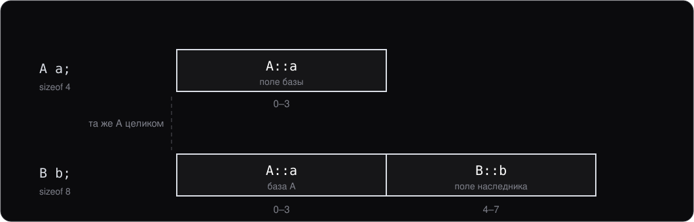
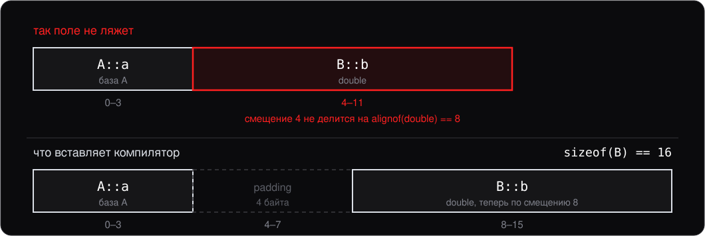
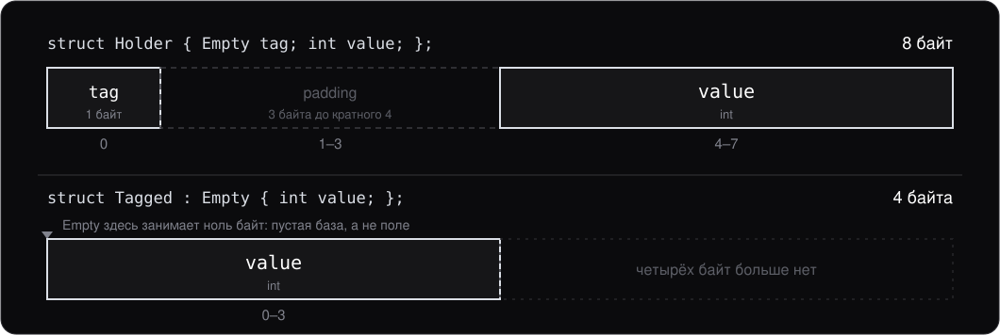
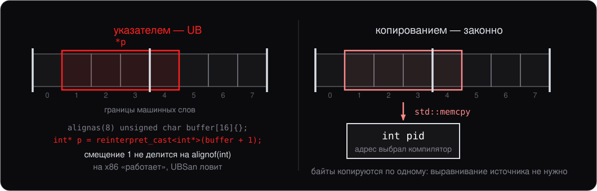
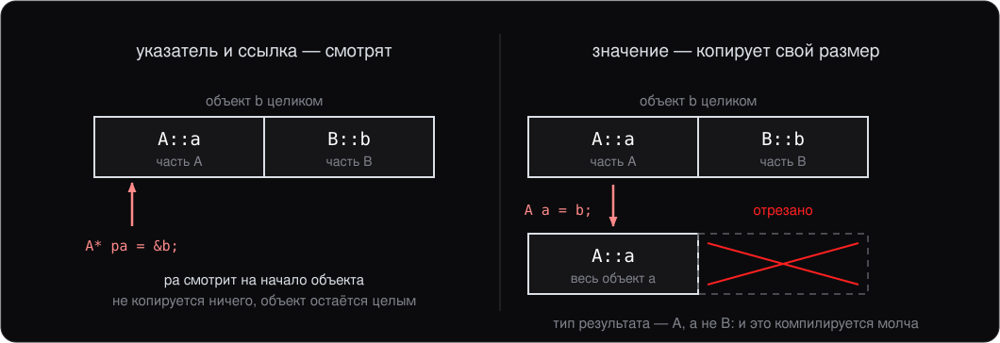
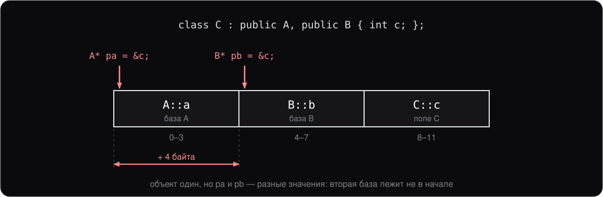
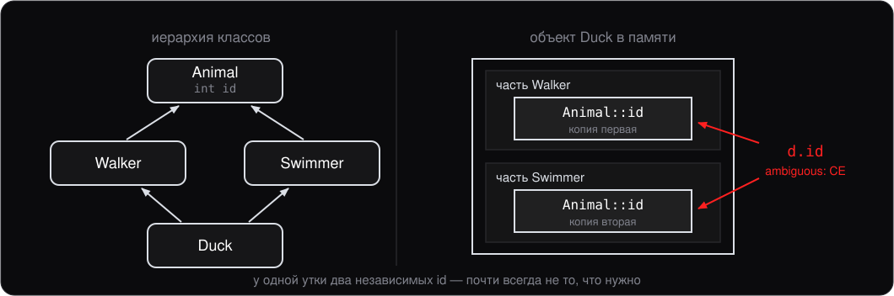
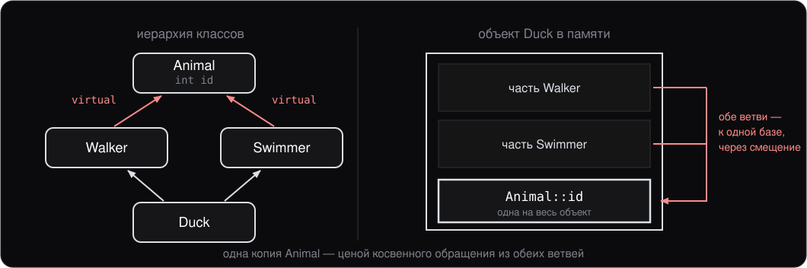
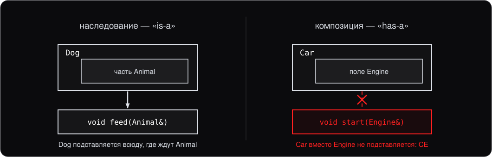

# Лекция 6. Наследование

> Конспект к лекции для самостоятельного чтения. Слайды (`slides.md`) повторяют структуру, конспект подробнее объясняет «почему».

## 0. О чём эта лекция

Это вторая лекция про классы. На лекции 4 мы научились их **создавать**: поля, методы, конструкторы, деструкторы, [агрегатная инициализация](../glossary.md#aggregate) (aggregate initialization). На лекции 5 — **давать им поведение в выражениях** через [перегрузку](../glossary.md#overload) (overloading) операторов. Сегодня — **строить из классов иерархии**, чтобы один класс мог переиспользовать функциональность другого.

Сразу два предупреждения. Во-первых, в современном C++ наследование используется **реже**, чем в Java или Python; чаще предпочитают композицию или шаблоны. Мы это обсудим в последнем разделе. Во-вторых, **множественное наследование** есть не везде — в Java и C# класс наследует только один класс, — а **виртуальное наследование** и вовсе особенность C++. Они существуют не как «крутые фичи», а как ответ на конкретные ситуации.

К концу лекции вы должны:

- Уметь объявить класс-наследник; знать, откуда видны члены базы при `public`, `protected` и `private` наследовании и когда нужно каждое.
- Знать, в каком порядке выделяется память и вызываются конструкторы и деструкторы, как передавать аргументы в конструктор базы.
- Знать правила выравнивания: откуда в структуре padding, почему порядок полей меняет `sizeof` и почему обращение по невыровненному адресу — UB и на x86.
- Понимать layout объекта при одиночном и множественном наследовании, и почему `static_cast` при множественном наследовании может сдвигать указатель.
- Понимать, чем опасно ромбовидное наследование и какую роль играет виртуальное наследование.
- Отличать «is-a» от «has-a» и знать, когда наследование стоит заменить полем.

**Виртуальные функции и полиморфизм** — следующая лекция. Здесь мы говорим только про устройство иерархии, без `virtual`-методов.

## 1. Идея наследования

Наследование позволяет одному классу получить **поля и методы другого**:

```cpp
class Animal {
public:
    void breathe() { std::print("breathing\n"); }
    int age = 0;
};

class Dog : public Animal {
public:
    void bark() { std::print("woof\n"); }
};

Dog d;
d.breathe();   // унаследовано
d.bark();      // своё
d.age = 5;     // унаследованное поле
```

`Dog` — это **[подтип](../glossary.md#subtyping)** (subtype) `Animal`. Где работает `Animal` — работает `Dog`. Это и есть отношение **[«is-a»](../glossary.md#is-a)** («является»).

## 2. Доступ при наследовании

```cpp
class Dog : public    Animal { /* ... */ };
class Dog : protected Animal { /* ... */ };
class Dog : private   Animal { /* ... */ };
```

**[Спецификатор доступа](../glossary.md#access-specifier)** (access specifier) перед базой решает, **откуда** видны члены `Animal`, доставшиеся `Dog`. Здесь легко смешать два разных вопроса: каким объявлен член в самой `Animal` — `public`, `protected` или `private` внутри класса, — и каким спецификатором `Dog` наследует `Animal`. Разберём их по очереди.

### Три вида членов базы

```cpp
class Animal {
public:
    void breathe() {}
protected:
    void digest() {}
private:
    int heart_rate_ = 60;
};

class Dog : public Animal {
public:
    void eat() {
        breathe();          // ok
        digest();           // ok: protected виден наследнику
        // heart_rate_ = 0; // CE: private виден только самому Animal
    }
};

Dog d;
d.breathe();                // ok
// d.digest();              // CE: снаружи protected не виден
```

`protected` — промежуточный уровень между `public` и `private`: для внешнего кода член закрыт, как `private`, а наследникам открыт. `private`-члены базы наследнику **недоступны вообще**, при любом спецификаторе наследования. Они по-прежнему лежат внутри объекта `Dog` (раздел 3), но обращаться к ним может только код самой `Animal`. Если наследнику нужно на них влиять, база даёт для этого `protected`- или `public`-методы.

### Откуда видны члены базы

Теперь второй вопрос — спецификатор наследования. Удобнее всего держать его в голове как ответ на вопрос «откуда обращаемся»:

| Наследование | в методах `Dog` | в наследниках `Dog` | снаружи |
|---|---|---|---|
| `public` | public и protected | public и protected | только public |
| `protected` | public и protected | public и protected | ничего |
| `private` | public и protected | ничего | ничего |

Три наблюдения по таблице.

1. **Первый столбец одинаков.** Внутри самого `Dog` спецификатор наследования ничего не меняет: он описывает, что увидят те, кто стоит дальше, — наследники `Dog` и внешний код.
2. **Спецификатор только понижает доступ.** `public`-член `Animal` при `protected` наследовании становится в `Dog` `protected`, при `private` — `private`. Повысить доступ наследованием нельзя.
3. **[Upcast](../glossary.md#upcast-downcast) (преобразование к базовому классу) подчиняется тем же правилам.** Привести `Dog*` к `Animal*` можно ровно там, где видны public-члены `Animal`: при `public` наследовании — везде, при `protected` — в `Dog` и его наследниках, при `private` — только в `Dog`. Для внешнего кода `Dog` с непубличной базой просто не является `Animal`.

### Когда `private` лучше поля

Непубличное наследование нужно, когда класс пользуется базой как **реализацией** и не хочет показывать её пользователям. Чаще всего то же самое делают полем, и это правильно (раздел 8). Но есть случаи, где поле хуже.

**Пустая база ничего не весит.** Пусть индекс файлов считает хеш имени [функтором](../glossary.md#functor) (function object) без состояния:

```cpp
struct Fnv1a {                      // хеш без состояния — пустой класс
    std::uint64_t operator()(const std::string& s) const;
};

class IndexByBase : private Fnv1a {  // sizeof == 8
    std::uint64_t* buckets_;
};

class IndexByField {                 // sizeof == 16
    Fnv1a hash_;
    std::uint64_t* buckets_;
};
```

Поле пустого класса занимает байт — у каждого объекта свой адрес, — а указатель за ним сдвигается на смещение 8, и поле обходится в восемь байт. Пустая база не занимает ничего: это [EBO](../glossary.md#ebo) (empty base optimization; по-русски — оптимизация пустой базы), подробно — в разделе 3. Ради неё реализации стандартной библиотеки хранят [deleter](../glossary.md#deleter) `std::unique_ptr`, [аллокатор](../glossary.md#allocator) (allocator) `std::vector` и компаратор `std::map` пустой базой, а не полем.

С C++20 того же можно добиться полем с атрибутом `[[no_unique_address]]`, но на Windows он не работает: [ABI](../glossary.md#abi) (application binary interface) этой платформы атрибут игнорирует, clang 19 предупреждает `unknown attribute 'no_unique_address' ignored` и оставляет 16 байт. С целью Linux тот же код даёт 8. Поэтому приём с базой остаётся в ходу.

**Скрытый интерфейс.** Агент подписывается на поток событий и для этого должен реализовать интерфейс подписчика. Но подписчиком для внешнего кода он быть не должен:

```cpp
class IEventListener {               // интерфейс подписчика
public:
    virtual void on_event(const Event& e) = 0;
};

class Agent : private IEventListener {
public:
    void start() { subscribe(*this); }   // внутри Agent upcast разрешён
private:
    void on_event(const Event& e) override;
};

Agent agent;
agent.start();
// subscribe(agent);                 // CE: снаружи Agent — не IEventListener
```

Внутри `Agent` upcast к `IEventListener&` разрешён, и агент подписывает себя сам. Снаружи — `cannot cast 'Agent' to its private base class 'IEventListener'`: никто не вызовет `on_event` и не подпишет агента второй раз. Полем пришлось бы заводить вложенный класс-слушатель, хранить в нём указатель на `Agent` и пересылать каждый вызов. Что делают `virtual` и `override`, разбирает лекция 7; здесь важно только то, что наследник реализует функцию, объявленную в базе.

**Открыть часть базы.** Третий случай слабее, он экономит только текст. Журнал событий, которому нужна лишь часть интерфейса вектора:

```cpp
class EventLog : private std::vector<Event> {
public:
    using std::vector<Event>::size;
    using std::vector<Event>::begin;
    using std::vector<Event>::end;
    void add(Event e) { push_back(std::move(e)); }
};
```

Объявление `using` открывает унаследованный метод с тем доступом, под которым оно стоит. Снаружи `log.size()` работает, а `log.clear()` не компилируется. Через поле каждый открытый метод пришлось бы писать функцией-обёрткой.

У `protected` наследования собственного случая нет. Это те же приёмы, когда базу должны видеть ещё и наследники класса, и на практике оно почти не встречается.

### Какой когда

- **`public`** — почти всегда. Это «is-a» в обычном смысле: `Dog` подставляется всюду, где ожидается `Animal&`.
- **`private`** — база как реализация, когда полем хуже: пустая база, скрытый интерфейс.
- **`protected`** — то же, но база видна и наследникам. Встречается редко.

Во всех остальных случаях вместо непубличного наследования пишут поле (раздел 8).

### Спецификатор по умолчанию

```cpp
class A : B { /* private наследование, частая ошибка */ };
class A : public B { /* то, что обычно хотят */ };
```

У `class` без спецификатора наследование **`private`** по умолчанию. У `struct` — **`public`**. Это та же история, что с членами: `class` всё прячет, `struct` всё показывает.

**Привычка:** всегда писать `public` явно. Не полагайтесь на дефолт — это слишком тонкая разница, на ней постоянно ошибаются.

## 3. Layout объекта

Объект наследника содержит **полную копию** базы плюс свои поля:

```cpp
class A { int a; };
class B : public A { int b; };

sizeof(B);                  // 8
```

[Layout](../glossary.md#layout) (object layout; по-русски — размещение в памяти):



Базовый класс **в начале** объекта. Это важно — даёт возможность смотреть на `B*` как на `A*` без сдвига указателя.

### Выравнивание

Процессор читает память не по байту, а словами по 4, 8 и больше байт, и быстрее всего — когда слово начинается с адреса, кратного его размеру. Поэтому у каждого типа есть **требование [выравнивания](../glossary.md#alignment)** (alignment): адрес объекта этого типа обязан быть кратен определённому числу. Узнаётся оно оператором `alignof`:

```cpp
alignof(char);     // 1
alignof(short);    // 2
alignof(int);      // 4
alignof(double);   // 8
alignof(int*);     // 8 на 64-битной системе
```

Числа — типичные для x86-64: по стандарту их выбирает реализация. У встроенных типов выравнивание обычно равно размеру.

Нарушение выравнивания — не только вопрос скорости. Для языка обращение к объекту по невыровненному адресу — [UB](../glossary.md#ub) (undefined behavior) на любом процессоре, и писать так нельзя. Что при этом сделает железо, зависит от архитектуры: обычные команды x86 невыровненное прочитают и запишут, а SPARC и часть ARM остановят программу. Но и на x86 «железо справится» ничего не гарантирует: компилятор строит код в расчёте на выравнивание. Как невыровненный адрес получается в коде и чем это кончается на x86 — в конце раздела.

### Правила размещения полей

Компилятор раскладывает поля по трём правилам:

1. Поля лежат **в порядке объявления**.
2. Каждое поле лежит по смещению, кратному **его** выравниванию. Если предыдущее поле закончилось раньше, компилятор вставляет пустые байты — **[padding](../glossary.md#padding)** (по-русски — выравнивающие байты).
3. Выравнивание класса — **наибольшее** из выравниваний его полей, и размер класса кратен этому выравниванию. Поэтому padding бывает и в конце.

```cpp
struct Event {
    char kind;         // смещение 0
    double timestamp;  // смещение 8: перед ним 7 байт padding
    int pid;           // смещение 16, за ним 4 байта padding
};

static_assert(alignof(Event) == 8);
static_assert(sizeof(Event) == 24);  // полезных байт — 13
```

Смещение поля можно спросить у компилятора: `offsetof(Event, pid)` из `<cstddef>` даёт 16.

Хвостовой padding нужен из-за массивов. Элементы массива лежат вплотную, без промежутков: `Event events[2]` занимает ровно `2 * sizeof(Event)` байт. Будь `sizeof(Event)` равен 20, второй элемент начался бы со смещения 20, и его `timestamp` оказался бы не выровнен. Поэтому промежуток между элементами хранится внутри самого типа.

### Порядок полей


Те же три поля, объявленные в другом порядке:

```cpp
struct CompactEvent {
    double timestamp;  // смещение 0
    int pid;           // смещение 8
    char kind;         // смещение 12, за ним 3 байта padding
};

static_assert(sizeof(CompactEvent) == 16);
```

Данные те же, размер на треть меньше. Сам компилятор поля не переставит: порядок объявления гарантирован, и от него зависит ещё и порядок инициализации полей (раздел 4).

Разница важна там, где объектов много. Очередь событий в долгоживущем агенте хранит их сотнями тысяч, и восемь лишних байт на событие складываются в мегабайты. Для объекта, который существует в одном экземпляре, читаемость важнее экономии.

**Правило:** если объектов типа много — объявляйте поля от большего выравнивания к меньшему. Если объект один — в том порядке, в каком их удобнее читать.

### Выравнивание в наследнике

**[Подобъект](../glossary.md#subobject)** (subobject) базы участвует в layout как первое поле — со своим размером и своим выравниванием.

```cpp
class A { int a; };              // 4 байта, align 4
class B : public A { double b; };// 8 байт, align 8

sizeof(B);                       // 16
```



Padding появляется по второму правилу: `double` требует выравнивания 8, а после `A` мы стоим на смещении 4. Это те же правила, что и для одной структуры с полями `int a; double b;`.

### Пустой класс

У класса без полей размер всё равно ненулевой:

```cpp
struct Empty {};

struct Holder {
    Empty tag;
    int value;
};

struct Tagged : Empty {
    int value;
};

static_assert(sizeof(Empty) == 1);
static_assert(sizeof(Holder) == 8);
static_assert(sizeof(Tagged) == 4);
```



Каждый объект обязан иметь свой адрес: два разных объекта `Empty` не могут лежать по одному адресу, поэтому пустой класс занимает байт. А базой он может не занимать ничего: подобъект пустой базы разрешено разместить по тому же адресу, что и первое поле наследника. Это **EBO**, и её делают все основные компиляторы. На ней стоят типы стандартной библиотеки: `std::unique_ptr` со стандартным deleter (лекция 2) занимает ровно столько, сколько указатель.

### `alignas`

Выравнивание можно повысить, но не понизить:

```cpp
struct alignas(64) Counter {
    long long hits;
};

static_assert(alignof(Counter) == 64);
static_assert(sizeof(Counter) == 64);  // по третьему правилу
```

Так делают, когда данные должны начинаться с определённой границы: под векторные команды процессора или чтобы счётчики разных потоков не делили одну [кэш-линию](../glossary.md#cache-line) (cache line) — почему это важно, за рамками курса. В прикладном коде `alignas` встречается редко; знать его стоит, чтобы читать чужой.

### Невыровненный доступ

Невыровненный адрес в коде обычно получается из `reinterpret_cast` (лекция 3): взяли буфер байтов и посмотрели на его середину как на `int`.

```cpp
alignas(8) unsigned char buffer[16]{};
int* p = reinterpret_cast<int*>(buffer + 1);
*p = 5;  // UB: адрес не кратен alignof(int)
```

[UBSan](../glossary.md#ubsan) (UndefinedBehaviorSanitizer; лекция 1, раздел 7) такую запись ловит: `store to misaligned address ... for type 'int', which requires 4 byte alignment`.



На практике это встречается при разборе двоичных данных: пакет телеметрии приходит буфером байтов, и поле `pid` лежит в нём по смещению, которое никто не выравнивал. Правильный способ достать такое поле — скопировать байты в выровненную переменную:

```cpp
int pid;
std::memcpy(&pid, buffer + 1, sizeof(pid));  // из <cstring>
```

Такой `memcpy` компилятор обычно превращает в одну команду чтения, так что по скорости он не проигрывает.

### UB и на x86

То, что x86 умеет читать невыровненное, не делает такой код корректным. Компилятор вправе считать, что объект типа `T` лежит по адресу, кратному `alignof(T)`, и выбирать команды под это обещание. Пример — отсчёты датчика, которые упаковываются в пакет следом за четырёхбайтовым заголовком:

```cpp
struct alignas(16) Sample {
    float x, y, z, w;
};

// пакет: 4 байта заголовка, следом отсчёты
void pack(unsigned char* packet, const Sample* samples, std::size_t n) {
    for (std::size_t i = 0; i < n; ++i) {
        auto* dst = reinterpret_cast<Sample*>(packet + 4 + i * sizeof(Sample));
        *dst = samples[i];  // UB: адрес не кратен 16
    }
}
```

`alignas(16)` обещает, что каждый `Sample` начинается с адреса, кратного 16. Без оптимизаций (`-O0`) программа отрабатывает: компилятор копирует отсчёт двумя обычными командами по восемь байт, а им выравнивание не нужно. С `-O1` и выше clang копирует все шестнадцать байт одной векторной командой `movaps`, которая, в отличие от обычных, принимает только адрес, кратный 16. На невыровненном адресе процессор останавливает программу: [segmentation fault](../glossary.md#segfault) на Linux, [нарушение доступа](../glossary.md#access-violation) (access violation) на Windows. Проверено clang 19 на x86-64.

Это UB в чистом виде: одна и та же программа работает или падает в зависимости от уровня оптимизации, и правильного варианта среди них нет. Опасно здесь не железо, а то, что компилятор строит код на обещании, которое программа нарушила. Исправление то же, что выше:

```cpp
std::memcpy(packet + 4 + i * sizeof(Sample), &samples[i], sizeof(Sample));
```

`memcpy` не требует выравнивания ни от источника, ни от приёмника, и компилятор выберет для него команды, которые невыровненный адрес принимают.

### Upcast: указатель базы на наследника

Поскольку `A` лежит в начале `B`, указатель на `A` совпадает по адресу с указателем на `B`:

```cpp
B b;
A* pa = &b;       // ok при public наследовании
A& ra = b;        // то же со ссылкой
pa->a;            // ok: A знает про свои поля
// pa->b;         // CE: A не знает про B::b
```

Этот **неявный upcast** работает только при `public` наследовании — иначе компилятор запретит, потому что снаружи `B` не публично «является» `A`. С `private` наследованием вы можете upcast'ить **внутри** `B` (там доступ есть), но не снаружи.

С указателями и наследованием связано целое семейство [кастов](../glossary.md#cast) (casts) — обычные (`static_cast`) для compile-time преобразований и `dynamic_cast` для рантайм-проверки. Подробно — на следующей лекции, когда добавим [виртуальные функции](../glossary.md#virtual-function) (virtual functions).

### Срезка

Указатель и ссылка на базу работают безобидно: они просто *смотрят* на объект, ничего не копируя. А вот присваивание **по значению** ведёт себя принципиально иначе:

```cpp
B b;
A a = b;          // компилируется без единого предупреждения
```

Разберём, что здесь произошло, опираясь на только что разобранный layout. Переменная `a` имеет тип `A`, а значит занимает ровно `sizeof(A)` байт. В объекте `b` подобъект `A` лежит в начале, и [копирующий конструктор](../glossary.md#copy-constructor) (copy constructor) `A` знает только про свои поля — он скопирует их и остановится. Всё, что добавлял `B`, в `a` просто не поместилось и было **отрезано**.

Это явление называется **[срезкой](../glossary.md#slicing)** (object slicing). Ключевой момент, который делает её опасной: с точки зрения языка ничего плохого не произошло. Компилятор промолчит, программа не упадёт, `a` — совершенно корректный объект типа `A`. Просто это уже не тот объект, который вы копировали.



Пока вы работаете через `A*` или `A&`, объект остаётся собой; как только он попал в переменную типа `A`, от него осталась только базовая часть.

Отсюда — два места, где срезка реально кусается.

**Первое: передача в функцию.**

```cpp
void handle(A a);          // срежет любого наследника
void handle(const A& a);   // не срежет
```

Именно поэтому на лекции 3, обсуждая четыре способа передачи, мы говорили: полиморфные объекты передают по `const&`. Тогда аргументом была экономия на копировании; теперь видно, что дело не только в ней.

**Второе: ловля исключений.** На лекции 3 было сказано «исключения ловят по `const&`» и обещано объяснить, почему. Вот объяснение:

```cpp
try {
    throw std::invalid_argument("bad port");
} catch (std::exception e) {          // срезка!
    std::print("{}\n", e.what());     // напечатает generic-текст базового класса
}
```

Брошен был `std::invalid_argument`, а поймали по значению базового `std::exception` — копия получилась базовой, и вся конкретика потерялась. Проверить это можно за минуту: первый вариант печатает родовое `std::exception`, второй — переданный текст `bad port`. Исправление — одна пара символов:

```cpp
} catch (const std::exception& e) {   // ссылка: объект остался собой
```

Небольшая, но приятная оговорка: конкретно для `catch` компиляторы научились предупреждать — GCC и Clang выдают `-Wcatch-value`, если ловить полиморфный тип по значению. А вот про обычное `A a = b;` не предупредит никто: там срезка может быть и вполне намеренной, и отличить её от ошибки компилятор не в состоянии.

**Правило:** объекты полиморфных иерархий передают, хранят и ловят по ссылке или указателю. По значению — только когда вы точно знаете конкретный тип и хотите именно копию.

## 4. Порядок конструкторов и деструкторов

При создании объекта-наследника конструкторы вызываются в строгом порядке:

```cpp
class A {
public:
    A() { std::print("A()\n"); }
    ~A() { std::print("~A()\n"); }
};

class B : public A {
public:
    B() { std::print("B()\n"); }
    ~B() { std::print("~B()\n"); }
};

{ B b; }
```


Порядок конструкторов: **база → поля наследника → тело конструктора наследника**.
Порядок деструкторов: **обратный** — тело деструктора наследника → поля → база.

Память в этой цепочке стоит по краям. Сначала объекту выделяется место целиком — `sizeof(B)` байт вместе с подобъектом `A`; база отдельной памяти не получает. Конструкторы, начиная с базового, работают на уже выделенном месте, деструкторы — тоже, а память отдаётся после последнего из них. Для `new B` это ровно два шага из лекции 2: `operator new` выделяет память, затем вызываются конструкторы; `delete` вызывает деструкторы, затем `operator delete` возвращает память. У локальной переменной вроде `{ B b; }` место лежит в [кадре стека](../glossary.md#stack-frame) (stack frame) функции, и [аллокатор](../glossary.md#allocator) (allocator) не вызывается вовсе.

### Передача аргументов в конструктор базы

Если у базы **нет [конструктора по умолчанию](../glossary.md#default-constructor)** (default constructor), нужно вызвать её конструктор явно, в [списке инициализации членов](../glossary.md#member-initializer-list) (member initializer list):

```cpp
class A {
public:
    A(int x) : x_(x) {}
    int x_;
};

class B : public A {
public:
    B(int x, int y) : A(x), y_(y) {}    // вызываем A(int)
    int y_;
};

B b(1, 2);     // A::x_ = 1, B::y_ = 2
```

Вызов конструктора базы пишется **в списке инициализации членов** наследника, **до** своих полей. Если не написать — компилятор попробует вызвать конструктор по умолчанию базы, и если его нет — [CE](../glossary.md#ce) (compilation error).

### Полный порядок при создании `Derived`

1. Виртуальные базы (если есть, см. дальше)
2. Обычные базы — **в порядке объявления** `class D : A, B, C { }` (то есть `A` → `B` → `C`)
3. Поля `Derived` — **в порядке объявления в классе** (не в порядке в списке инициализации членов!)
4. Тело конструктора `Derived`

Деструкторы — **зеркально обратный** порядок. Полностью симметрично и детерминированно. Полезное упражнение — мысленно проиграть для класса с двумя базами и тремя полями.

## 5. Множественное наследование

В отличие от Java и C#, где класс наследует ровно один класс, а от интерфейсов берёт только объявления, C++ разрешает наследоваться **от нескольких классов** — это [множественное наследование](../glossary.md#multiple-inheritance) (multiple inheritance):

```cpp
class Walker  { public: void walk() { std::print("walk\n"); } };
class Swimmer { public: void swim() { std::print("swim\n"); } };

class Duck : public Walker, public Swimmer {};

Duck d;
d.walk();
d.swim();
```

Главный use case — **миксины**: независимые наборы функциональности комбинируются в один класс. Класс `Duck` получает способность ходить от `Walker` и плавать от `Swimmer`. В Java это были бы `interface` + composition; в C++ — обычные базовые классы.

Базовая идея простая. Сложности начинаются, когда классы-базы пересекаются (см. раздел 6) или когда нужно понять layout.

### Порядок конструкторов с несколькими базами

При создании `Duck` базы конструируются **в порядке объявления** в списке наследования:

```cpp
class Duck : public Walker, public Swimmer { /* ... */ };
// 1. Walker()
// 2. Swimmer()
// 3. Duck::Duck() тело
// Деструкторы — обратно.
```

**Порядок в списке инициализации членов не имеет значения** — компилятор всё равно вызовет в порядке объявления. И в списке инициализации членов можно перечислить базы в любом порядке.

### Layout с несколькими базами

```cpp
class A { int a; };
class B { int b; };
class C : public A, public B { int c; };

sizeof(C);   // 12
```



Базы лежат **подряд**, в порядке объявления. После них — собственные поля наследника.

### Подвох: upcast при множественном наследовании сдвигает указатель

Это важное следствие layout — у одиночного наследования такого нет:

```cpp
C c;
A* pa = &c;       // pa == &c (адрес 0)
B* pb = &c;       // pb == &c + 4 (адрес 4!)
```

Поэтому `static_cast<B*>(&c)` не просто меняет тип указателя — он **сдвигает значение** на смещение `B` внутри `C`.

В одиночном наследовании этого не было: указатель на `A` совпадал с указателем на `B`, потому что `A` лежала в начале. При множественном наследовании это работает только для **первой** базы; для остальных компилятор молча сдвигает указатель при касте.

Это не баг — это следствие layout. Просто помните: при множественном наследовании касты между базами и наследником **могут менять значение указателя**.

## 6. Ромбовидное наследование

Когда у двух промежуточных классов общая база — получается **ромб**, [ромбовидное наследование](../glossary.md#diamond) (diamond inheritance):

```cpp
class Animal { public: int id; };
class Walker  : public Animal { /* ... */ };
class Swimmer : public Animal { /* ... */ };
class Duck    : public Walker, public Swimmer {};
```



Копии независимы: `id`, доставшийся через `Walker`, и `id`, доставшийся через `Swimmer`, — разные поля в разных местах объекта.

### Что ломается

```cpp
Duck d;
d.id = 5;          // CE: ambiguous, какая копия id?

d.Walker::id = 5;  // нужно явно: id из Walker-ветки
d.Swimmer::id = 6; // другая копия
```

Это **редко** то, что мы хотим. Обычно `Animal` должен быть один — у одной утки одно `id`. Кроме семантической [неоднозначности](../glossary.md#ambiguous) (ambiguity), это и лишняя память (две копии всех полей `Animal`).

## 7. Виртуальное наследование

Чтобы базовый класс был **один** в ромбе, наследование от него помечается `virtual` — это **[виртуальное наследование](../glossary.md#virtual-inheritance)** (virtual inheritance):

```cpp
class Animal { public: int id; };
class Walker  : virtual public Animal { /* ... */ };
class Swimmer : virtual public Animal { /* ... */ };
class Duck    : public Walker, public Swimmer {};

Duck d;
d.id = 5;       // ok, теперь одна копия Animal
```



`virtual` стоит на **обоих** промежуточных классах.

### Цена и почему его избегают

- **Лишний уровень косвенного обращения** при доступе к виртуальной базе. Компилятор хранит указатель на «реальное место» базы в объекте.
- **Конструктор виртуальной базы вызывается из [наиболее производного класса](../glossary.md#most-derived)** (most derived class, здесь `Duck`), а не из промежуточных. Это делает иерархию хрупкой: добавляешь промежуточный класс — надо переписывать вызовы.
- Сложнее layout, сложнее кастовать.

В **реальном** прикладном коде ромбовидное наследование избегают как класс. Если кажется, что оно нужно — обычно стоит:

- Заменить промежуточный класс на интерфейс — базу без полей из [чисто виртуальных](../glossary.md#pure-virtual) (pure virtual) функций (лекция 7)
- Заменить часть наследований полями (раздел 8)
- Пересмотреть дизайн

Виртуальное наследование встречается в основном в **библиотечном** коде (классический пример — иерархия потоков `iostream`). В прикладном — почти никогда.

## 8. Наследование или композиция

Объект одного класса можно включить в другой двумя способами: сделать его **базой** или **полем**. Второе называют композицией:

```cpp
class Engine { /* ... */ };

class Car   { Engine engine_; };            // композиция: Car has an Engine
class Truck : public Engine { /* ... */ };  // наследование: Truck is an Engine?
```

Второе обычно неверно: грузовик не является двигателем, он его использует.



Обратите внимание, чем эти два случая **не** различаются: в памяти картинка одна и та же — подобъект базы и поле лежат одинаково (раздел 3). Различается то, куда объект разрешено подставить.

### Когда наследование уместно

1. **Подтипизация (subtyping).** Функция принимает `Base&`, передаём `Derived`, всё работает. На этом построен полиморфизм — следующая лекция.
2. **Расширение интерфейса.** Производный класс **добавляет** новые методы или **меняет поведение** существующих. Без `virtual` — только добавляет; с `virtual` — может менять.

В остальных случаях поле лучше: оно меньше связывает классы, его можно заменить, не перестраивая иерархию, и с ним не бывает проблем множественного наследования вроде ромба (раздел 6).

### Непубличное наследование и поле

При `protected` и `private` наследовании внешний код и так не знает, что класс устроен через базу. Поэтому снаружи поле и непубличная база неотличимы, и в прикладном коде пишут поле: его проще читать и проще заменить.

Наследование берут, когда полем не обойтись. Два таких случая разобраны в разделе 2 — пустая база, которая ничего не весит, и скрытая реализация интерфейса. Третий — когда нужны `protected`-члены базы: через поле доступны только `public`.

То же касается ромба (раздел 7): если иерархия без него не строится, часть баз обычно заменяют полями или интерфейсами.

**Правило:** «is-a» — наследование, «has-a» — композиция. Когда сомневаетесь — берите композицию.

## Итоги

- **Спецификатор при наследовании** решает, откуда видны члены базы: при `public` — отовсюду, при `protected` — из ветки наследников, при `private` — только из самого класса. `private`-члены базы не видны наследнику никогда. Дефолт у `class` — `private`, у `struct` — `public`; всегда пишите явно.
- **Layout:** база в начале, потом поля наследника. Поля лежат в порядке объявления, каждое — по смещению, кратному его `alignof`; между полями и в конце — padding, поэтому порядок полей меняет `sizeof`. Невыровненный доступ — UB и на x86: с оптимизацией компилятор опирается на выравнивание. Байты из буфера достают через `memcpy`.
- **Срезка:** копирование наследника в переменную базового типа отрезает всё, что добавил наследник, — молча. Полиморфные объекты передают и ловят по ссылке или указателю.
- **Порядок:** память под объект целиком → базы (по объявлению) → поля (по объявлению в классе) → тело. Деструкторы — обратно, память отдаётся последней. Базу с параметрами вызывают в списке инициализации членов.
- **Множественное наследование:** базы лежат подряд в памяти. Upcast между базами может сдвигать значение указателя.
- **Ромб:** две копии общей базы, обычно нежелательно. Решается `virtual` наследованием, но в реальном коде его избегают.
- **«is-a» — наследование, «has-a» — композиция.** Непубличное наследование почти всегда заменяется полем; в сомнении — композиция.

## Что дальше

Следующая лекция — **полиморфизм и виртуальные функции**:

- Касты в иерархии классов (upcast / downcast)
- Виртуальные функции, `override`, `final`
- [Абстрактные классы](../glossary.md#abstract-class) (abstract classes) (`= 0`) и чисто виртуальные методы
- Виртуальный деструктор (обязателен!)
- `dynamic_cast` — безопасный downcast
- Таблица вызовов, собранная руками: как устроен `virtual`
- `enum class` как современная замена `enum`
