<style>
section {
    font-size: 25px;
}
</style>

<!-- _class: lead -->

# Лекция 6.

## Наследование

---

# План

1. Идея наследования
2. Доступ при наследовании
3. Layout объекта
4. Порядок конструкторов и деструкторов
5. Множественное наследование
6. Ромбовидное наследование
7. Виртуальное наследование

---
<!-- header: 1. Идея наследования -->

# 1. Идея наследования

**Наследование** позволяет одному классу получить **поля и методы** другого:

```cpp
class Animal {
public:
    void breathe() { std::print("breathing\n"); }
    int age = 0;
};

class Dog : public Animal {       // Dog наследуется от Animal
public:
    void bark() { std::print("woof\n"); }
};
```

`Dog` получил все публичные члены `Animal` — `breathe()` и `age`.

---

## Использование

```cpp
Dog d;
d.breathe();   // унаследовано
d.bark();      // своё
d.age = 5;     // унаследованное поле
```

Это и есть **отношение «is-a»**: «`Dog` — это `Animal`». Любой `Dog` умеет всё, что умеет `Animal`, плюс что-то своё.

---

## Когда наследование уместно

1. **Подтипизация (subtyping).** Где работает `Base*`, должен работать `Derived*` (лекция 7).
2. **Расширение интерфейса.** Производный класс меняет поведение базового.

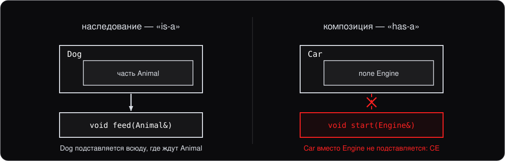

**Правило: «is-a» — наследование, «has-a» — композиция.** В сомнении — композиция.

---
<!-- header: 2. Доступ при наследовании -->

# 2. Доступ при наследовании

```cpp
class Dog : public    Animal { /* ... */ };
class Dog : protected Animal { /* ... */ };
class Dog : private   Animal { /* ... */ };
```

Спецификатор доступа (access specifier) указывает, **с какой стороны** становятся доступны члены базы через наследник.

Внутри самого `Dog` все члены `Animal` (кроме `private`) доступны независимо от спецификатора.

---

## Что становится с членами

| Член `Animal` | `public` наследование | `protected` | `private` |
|---|---|---|---|
| `public` | `public` в `Dog` | `protected` | `private` |
| `protected` | `protected` | `protected` | `private` |
| `private` | недоступен | недоступен | недоступен |

`private`-члены базы **всегда недоступны** наследнику. Они принадлежат только базе.

Спецификатор только **понижает** доступ — никогда не повышает.

---

## Какой когда

- **`public`** — почти всегда. Это «is-a» в обычном смысле.
- **`protected`** — редко. Наследовать реализацию, но не интерфейс.
- **`private`** — почти никогда. Эквивалент композиции, но уродливее.

В обычном коде `public` в 99% случаев. Если ставите `protected` или `private` — задумайтесь, не подойдёт ли композиция лучше.

---

## Спецификатор по умолчанию

- У `class` без спецификатора — **`private`** наследование
- У `struct` без спецификатора — **`public`**

```cpp
class A : B { /* private наследование — частая ошибка */ };
class A : public B { /* то, что обычно хотят */ };
```

**Привычка:** всегда писать `public` явно. Не полагайтесь на дефолт.

---
<!-- header: 3. Layout объекта -->

# 3. Layout объекта

Объект наследника содержит **полную копию** базы плюс свои поля:

```cpp
class A { int a; };
class B : public A { int b; };    // sizeof(B) == 8
```

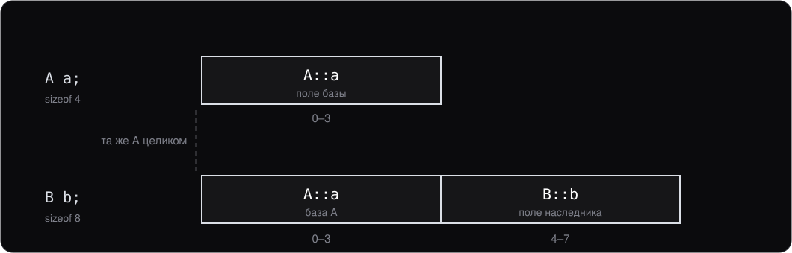

---

## Выравнивание

Адрес объекта обязан быть кратен **требованию выравнивания** (alignment) его типа:

```cpp
alignof(char);     // 1
alignof(int);      // 4
alignof(double);   // 8
alignof(int*);     // 8 на x86-64
```

- Процессор читает словами, выровненное слово — за одно обращение
- Числа выбирает реализация; выше — типичные для x86-64
- Обращение по невыровненному адресу — **UB** на любом процессоре

---

## Три правила размещения полей

1. Поля — **в порядке объявления**
2. Каждое поле — по смещению, кратному **его** `alignof`; между полями — **padding**
3. `alignof` класса — наибольший из полей, `sizeof` кратен ему: padding бывает и в конце

```cpp
struct Event {
    char kind;         // 0, дальше 7 байт padding
    double timestamp;  // 8
    int pid;           // 16, дальше 4 байта padding
};
static_assert(sizeof(Event) == 24);  // полезных — 13
```

Хвостовой padding — ради массивов: их элементы лежат вплотную.

---

## Порядок полей

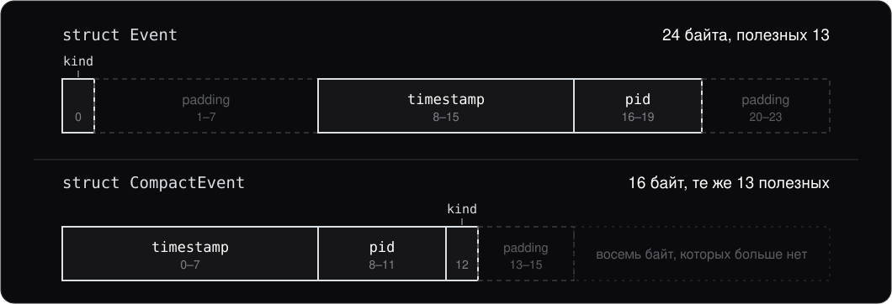

Компилятор поля не переставляет: порядок объявления гарантирован.

**Правило:** объектов много — поля от большего выравнивания к меньшему. Объект один — как удобнее читать.

---

## Выравнивание в наследнике

```cpp
class A { int a; };                // alignof 4
class B : public A { double b; };  // alignof 8
```

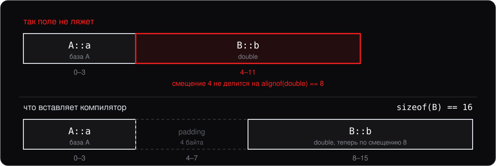

База — как первое поле: те же правила, что для структуры с `int a; double b;`.

---

## Пустая база и `alignas`

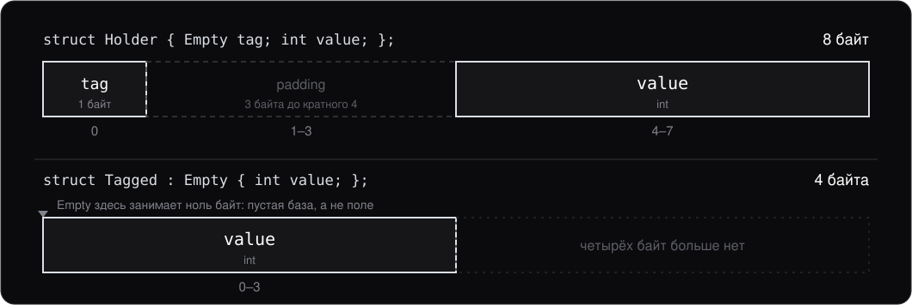

- Пустой класс занимает **1 байт**: у каждого объекта свой адрес. Пустая **база** — ноль байт; так `unique_ptr` остаётся размером с указатель
- `alignas` выравнивание только **повышает**: у `struct alignas(64) Counter { long long hits; };` и `alignof`, и `sizeof` равны 64

---

## Невыровненный доступ

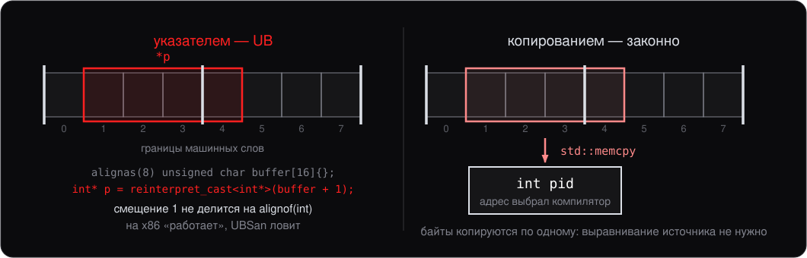

UBSan: `store to misaligned address ... requires 4 byte alignment`.

Поле из буфера байтов — пакета телеметрии — достают копированием: `std::memcpy(&pid, buffer + 1, sizeof(pid))`.

---

## Upcast: указатель базы на наследника

```cpp
B b;
A* pa = &b;          // ok: A лежит в начале B
A& ra = b;           // то же со ссылкой
pa->a;               // ok
// pa->b;            // CE: A не знает про B::b
```

`A*` указывает на «начало» `B` — то есть на ту самую `A`, что лежит первой. Это работает при `public` наследовании; при `private`/`protected` компилятор запретит снаружи класса.

---

## Срезка (slicing)

А вот присваивание **по значению** ведёт себя иначе:

```cpp
B b;
A a = b;             // компилируется. И это почти всегда баг
```

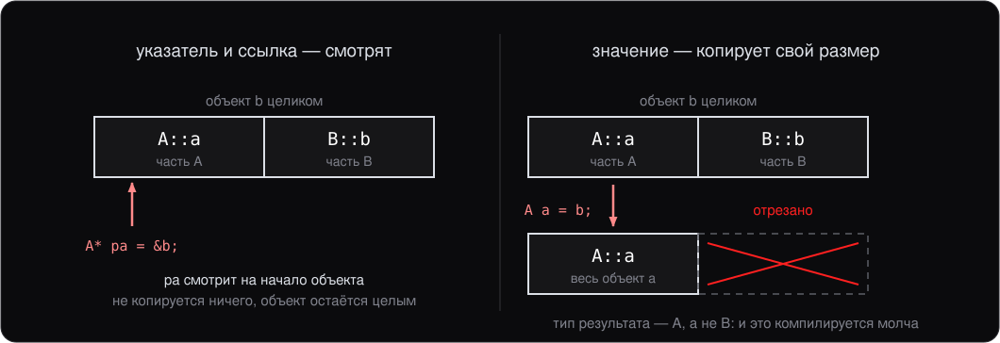

---

## Где срезка кусается

Самый частый случай — ловля исключений (лекция 3):

```cpp
catch (std::exception e)          // срезка: from invalid_argument к exception
catch (const std::exception& e)   // так правильно
```

Второй — передача в функцию:

```cpp
void f(A a);          // срежет
void f(const A& a);   // не срежет
```

**Правило:** полиморфные объекты передают и хранят по ссылке или указателю.

---
<!-- header: 4. Порядок конструкторов -->

# 4. Порядок конструкторов и деструкторов

```cpp
struct A { A() { std::print("A()\n"); } ~A() { std::print("~A()\n"); } };
class B : public A {
public:
    B()  { std::print("B()\n"); }
    ~B() { std::print("~B()\n"); }
};
{ B b; }
```

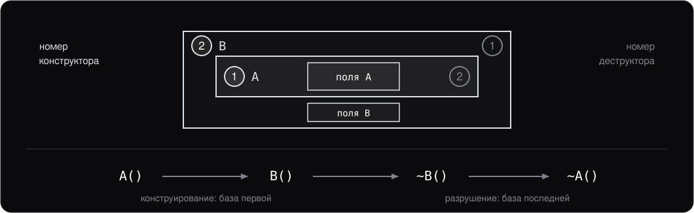

---

## Передача в конструктор базы

Если у базы нет конструктора по умолчанию (default constructor) — нужно вызвать её явно:

```cpp
class A {
public:
    A(int x) : x_(x) {}
    int x_;
};

class B : public A {
public:
    B(int x, int y) : A(x), y_(y) {}    // вызов A(int)
    int y_;
};
B b(1, 2);     // A::x_=1, B::y_=2
```

Конструктор базы вызывается **в списке инициализации членов** (member initializer list).

---

## Полный порядок конструкторов

При создании `Derived`:

1. Конструкторы **виртуальных** баз (см. дальше)
2. Конструкторы **обычных** баз — в порядке объявления `: A, B, C`
3. Поля `Derived` — в порядке объявления **в классе** (не в списке инициализации членов)
4. Тело конструктора `Derived`

Деструкторы — в обратном порядке. Полностью симметрично и детерминированно.

---
<!-- header: 5. Множественное наследование -->

# 5. Множественное наследование

C++ разрешает наследоваться **от нескольких** классов (multiple inheritance):

```cpp
class Walker  { public: void walk() { std::print("walk\n"); } };
class Swimmer { public: void swim() { std::print("swim\n"); } };

class Duck : public Walker, public Swimmer {};

Duck d;
d.walk();
d.swim();
```

Главный use case — **миксины**: независимые наборы функциональности комбинируются в один класс. Аналог `interface` в Java.

---

## Порядок конструкторов с несколькими базами

Базы конструируются **в порядке объявления**:

```cpp
class Duck : public Walker, public Swimmer { /* ... */ };
// 1. Walker()
// 2. Swimmer()
// 3. Duck() тело
// Деструкторы — обратно.
```

В списке инициализации членов можно перечислять базы в **любом порядке** — реально вызовутся **в порядке объявления**.

---

## Layout и upcast с несколькими базами

```cpp
class A { int a; };  class B { int b; };   // sizeof(C) == 12
```

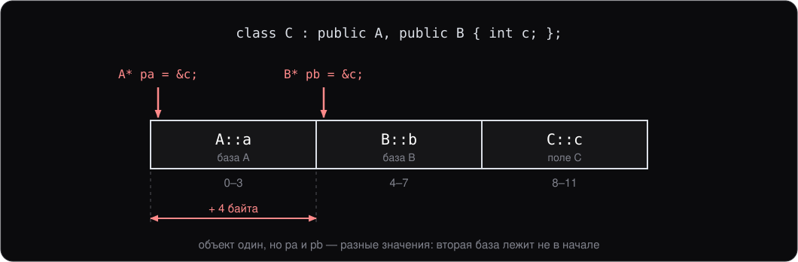

У одиночного наследования такого нет. Касты (casts) между базой и наследником, включая `static_cast`, **могут менять значение указателя**.

---
<!-- header: 6. Ромбовидное наследование -->

# 6. Ромбовидное наследование

Общая база у двух промежуточных классов — **ромб** (diamond inheritance):

```cpp
class Animal { public: int id; };
class Walker  : public Animal { /* ... */ };
class Swimmer : public Animal { /* ... */ };
class Duck    : public Walker, public Swimmer {};
```

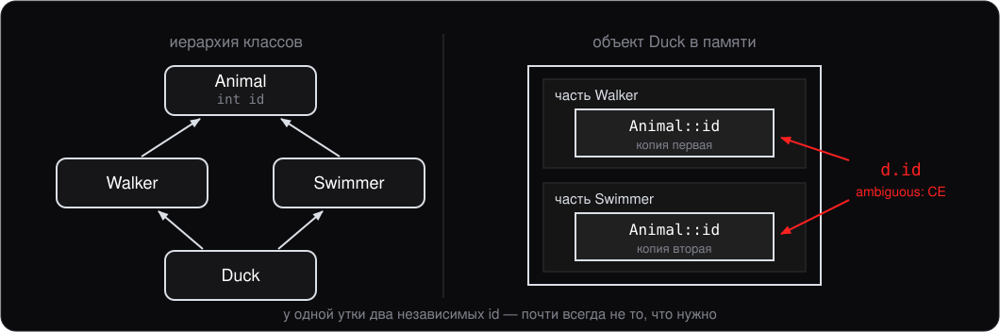

---

## Что ломается

```cpp
Duck d;
d.id = 5;          // CE: ambiguous, какая копия id?
d.Walker::id = 5;  // нужно явно указывать ветку
d.Swimmer::id = 6; // другая копия, независимая
```

Это **редко** то, что нужно. Обычно `Animal` должен быть **один** — у одной утки одно `id`.

Плюс лишняя память — две копии всех полей `Animal`.

---
<!-- header: 7. Виртуальное наследование -->

# 7. Виртуальное наследование

```cpp
class Walker  : virtual public Animal { /* ... */ };
class Swimmer : virtual public Animal { /* ... */ };
class Duck    : public Walker, public Swimmer {};   // d.id — ok
```

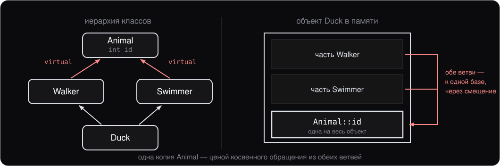

`virtual` (virtual inheritance) ставится на **обоих** промежуточных классах.

---

## Цена и оговорки

- **Лишний уровень косвенного обращения** при доступе к виртуальной базе
- **Конструктор виртуальной базы вызывается из наиболее производного класса** (most derived, `Duck`), а не из промежуточных
- Сложнее layout, сложнее `static_cast`

В реальном коде ромбовидное наследование **избегают**. Если оно понадобилось — обычно стоит пересмотреть дизайн (заменить часть наследования на композицию, использовать чисто виртуальные (pure virtual) интерфейсы).

Виртуальное наследование встречается в основном в библиотечном коде (например, в `iostream`).

---
<!-- header: Итоги -->

# Итоги лекции

- **Наследование = «is-a».** Композиция — «has-a». В сомнении — композиция.
- **Спецификаторы доступа `public`/`protected`/`private`** — что доступно пользователям. По умолчанию у `class` — `private`. Всегда писать явно.
- **Layout:** база в начале, поля — по порядку, каждое выровнено по `alignof`. Порядок полей меняет `sizeof`.
- **Срезка:** копия в переменную базового типа молча отрезает наследника. Полиморфные объекты — по ссылке или указателю
- **Порядок конструкторов:** базы → поля → тело. Деструкторы — обратно. Конструктор базы вызывается в списке инициализации членов.
- **Множественное наследование** — для миксинов. Базы лежат подряд, upcast может сдвигать указатель.
- **Ромб** — две копии базы, обычно не то, что нужно. Решается `virtual` наследованием, но в реальном коде его избегают.

---

# Дальше

Следующая лекция — **полиморфизм и виртуальные функции**:

- Касты в иерархии (upcast / downcast)
- Виртуальные функции (virtual functions), `override`, `final`
- Абстрактные классы (abstract classes) и чисто виртуальные функции
- Виртуальный деструктор (обязателен!)
- `dynamic_cast`
- Таблица вызовов руками: как устроен `virtual`
- `enum class`
