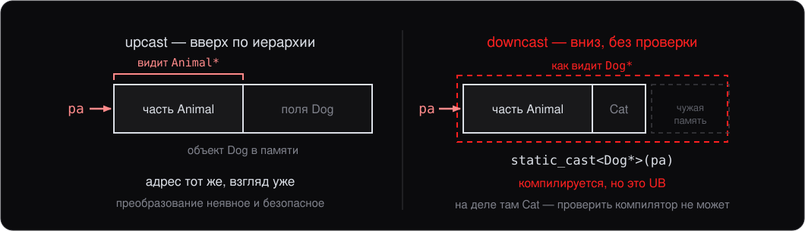
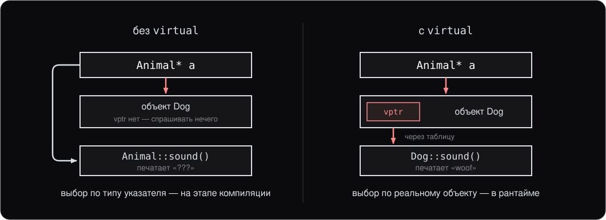
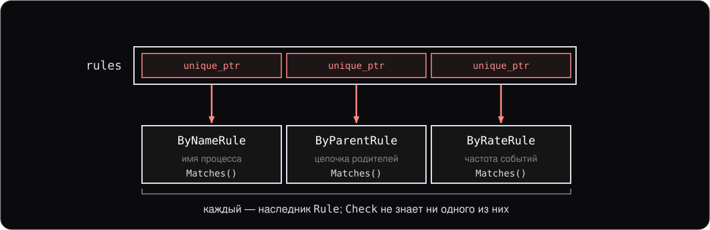
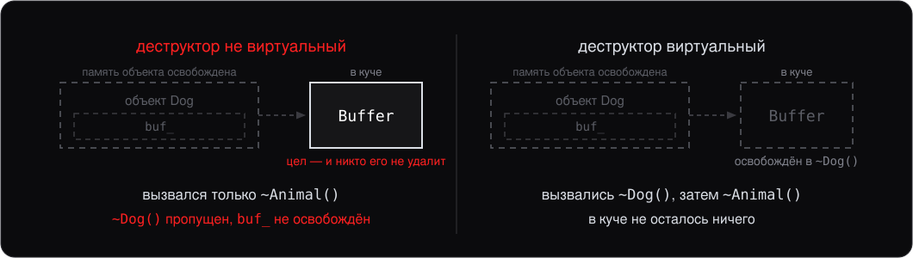
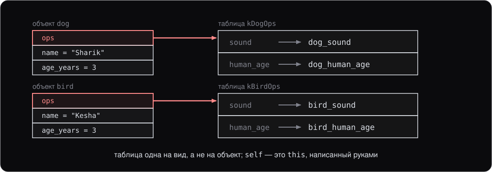
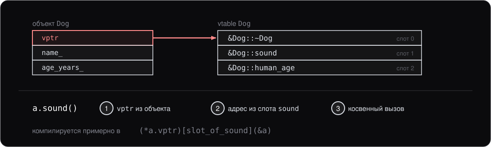
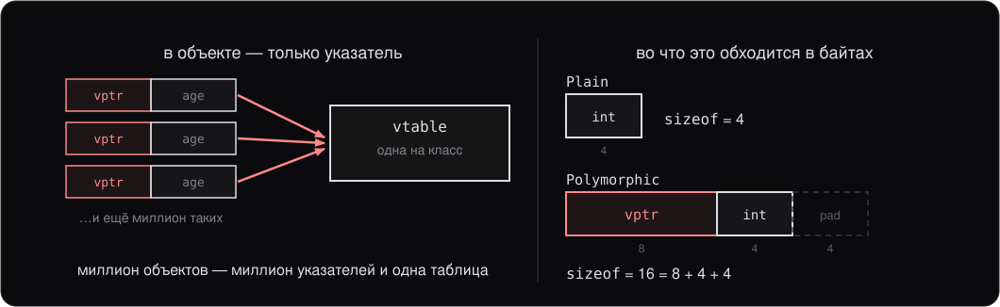

<style>
section {
    font-size: 25px;
}
</style>

<!-- _class: lead -->

# Лекция 7.

## Полиморфизм и виртуальные функции

---

# План

1. Касты при наследовании
2. Виртуальные функции
3. `override` и `final`
4. Абстрактные классы
5. Виртуальный деструктор
6. `dynamic_cast`
7. Таблица вызовов руками
8. `enum` и `enum class`

---
<!-- header: 1. Касты при наследовании -->

# 1. Касты при наследовании

На лекции 6 мы видели **upcast** — каст (cast) для него не нужен:

```cpp
class Animal { /* ... */ };
class Dog : public Animal { /* ... */ };

Dog d;
Animal* pa = &d;       // upcast, неявный, безопасный
```

Это работает, потому что `Dog` **является** `Animal`. Адреса совпадают (`Animal` лежит в начале объекта `Dog`).

---

## Downcast — обратно вниз

```cpp
Animal* pa = get_some_animal();
Dog* pd = pa;                       // CE: неявного преобразования нет
Dog* pd = static_cast<Dog*>(pa);    // компилируется, но опасно
```

Компилятор не может проверить, действительно ли `pa` указывает на `Dog`.

Безопасный downcast — через `dynamic_cast` (см. дальше), но работает только для **полиморфных** классов.

---

## Взгляд на одну и ту же память



---
<!-- header: 2. Виртуальные функции -->

# 2. Виртуальные функции

```cpp
class Animal {
public:
    void sound() { std::print("???\n"); }
};

class Dog : public Animal {
public:
    void sound() { std::print("woof\n"); }
};

Animal* a = new Dog();
a->sound();      // напечатает "???", не "woof"!
```

Функция выбрана **на этапе компиляции** — **статическое связывание** (static binding). У виртуальной функции (virtual function) — иначе:

---

## С `virtual` — динамическое связывание

```cpp
class Animal {
public:
    virtual void sound() { std::print("???\n"); }
};

class Dog : public Animal {
public:
    void sound() override { std::print("woof\n"); }
};

Animal* a = new Dog();
a->sound();      // теперь "woof"
```

`virtual` включает **динамическое связывание** (dynamic binding). Это и есть **полиморфизм**.

---

## Кто выбирает функцию



---
<!-- header: 3. override / final -->

# 3. `override` и `final`

`override` — подсказка компилятору: «я уверен, что это переопределение (overriding)».

```cpp
class Dog : public Animal {
public:
    void sound() override { /* ok, переопределение */ }
    void sound(int) override { /* CE: в Animal нет sound(int) */ }
    void Sound() override { /* CE: опечатка в имени */ }
};
```

`override` не меняет семантику — это **защита** от опечаток. Без него легко создать «новую» функцию вместо переопределения.

**Привычка:** всегда писать `override` на переопределённых виртуальных функциях.

---

## `final`

`final` запрещает дальнейшее переопределение / наследование:

```cpp
class Dog : public Animal {
public:
    void sound() final { /* ... */ }   // никакой Puppy не сможет переопределить
};

class Husky final : public Dog {};     // от Husky нельзя наследоваться
```

Применяется редко — в основном чтобы зафиксировать архитектуру или разрешить компилятору **devirtualization** (если он знает, что переопределений больше нет — может вызвать напрямую).

---
<!-- header: 4. Абстрактные классы -->

# 4. Абстрактные классы

**Чисто виртуальная функция** (pure virtual function) — виртуальная без реализации:

```cpp
class Shape {
public:
    virtual double area() const = 0;     // = 0 — чисто виртуальная
    virtual ~Shape() = default;
};
```

`Shape` — **абстрактный класс** (abstract class): его нельзя создать напрямую.

---

## Конкретный наследник

```cpp
class Circle : public Shape {
    double r_;
public:
    Circle(double r) : r_(r) {}
    double area() const override { return 3.14 * r_ * r_; }
};

Shape s;                          // CE: cannot instantiate abstract
Shape* p = new Circle(5);         // ok
std::print("{}\n", p->area());    // 78.5
```

`Circle` переопределил все чисто виртуальные методы — теперь это конкретный класс.

---

## Зачем нужны абстрактные

Абстрактные классы — это **интерфейсы**: описание контракта без реализации.

```cpp
class Rule {                              // правило детектирования
public:
    virtual bool Matches(const Event& e) const = 0;
    virtual std::string_view Name() const = 0;
    virtual ~Rule() = default;
};
```

Это аналог `interface` в Java и `abstract class` с `ABC` в Python. Если наследник не переопределил все чисто виртуальные — он тоже абстрактный.

---

## Зачем это на практике

Правил много, движок проверки один — и он не должен меняться от появления нового правила.

```cpp
std::vector<std::unique_ptr<Rule>> rules;

void Check(const Event& e) {
    for (const auto& rule : rules) {
        if (rule->Matches(e)) Alert(rule->Name());
    }
}
```

Добавить новое правило — значит добавить класс, **не трогая** `Check`.

---

## Разные типы в одном списке



---
<!-- header: 5. Виртуальный деструктор -->

# 5. Виртуальный деструктор

Опасная ситуация:

```cpp
class Animal {
public:
    ~Animal() { /* НЕ virtual */ }
};

class Dog : public Animal {
    std::unique_ptr<Buffer> buf_;
public:
    ~Dog() { /* должен освободить buf_, но... */ }
};

Animal* a = new Dog();
delete a;        // вызовется только ~Animal() → ~Dog() пропущен → UB
```

Через указатель на базу вызывается только `~Animal()`.

---

## Решение — `virtual`

```cpp
class Animal {
public:
    virtual ~Animal() = default;     // вот так
};

class Dog : public Animal {
public:
    ~Dog() override { /* ... */ }
};

Animal* a = new Dog();
delete a;        // теперь вызовутся ~Dog(), затем ~Animal()
```

**Жёсткое правило:** если в классе есть **любая** виртуальная функция — у него **должен** быть виртуальный деструктор. Без исключений.

---

## Что остаётся после `delete`



---
<!-- header: 6. dynamic_cast -->

# 6. `dynamic_cast`

`dynamic_cast` — единственный **безопасный** downcast. Проверяет реальный тип объекта в рантайме:

```cpp
Animal* a = get_some_animal();

Dog* d = dynamic_cast<Dog*>(a);
if (d) {
    d->bark();                       // это действительно Dog
} else {
    /* не Dog, например, Cat */
}
```

Если `a` реально указывает на `Dog` — возвращает указатель. Иначе — `nullptr`.

---

## Со ссылкой — исключение

Для **ссылок** `dynamic_cast` бросает `std::bad_cast` (нельзя вернуть «ничего»):

```cpp
try {
    Dog& d = dynamic_cast<Dog&>(*a);
    d.bark();
} catch (const std::bad_cast&) {
    /* не Dog */
}
```

Работает только для **полиморфных** классов — у которых есть хотя бы одна виртуальная функция (включая виртуальный деструктор).

---

## Когда использовать

В **хорошо спроектированном** OOP-коде `dynamic_cast` встречается **редко**. Обычно правильно — иметь виртуальную функцию.

Уместен, когда:

- Нужно реализовать **visitor** / RTTI-механизм
- Совместимость с библиотекой, возвращающей базовый тип
- Гетерогенная коллекция с гетерогенной обработкой (вынужденно)

Если в коде много `dynamic_cast` — пора пересмотреть дизайн.

---
<!-- header: 7. Таблица вызовов руками -->

# 7. Таблица вызовов руками

`virtual` — не магия компилятора. Тот же механизм — vtable — собирается на обычном C++.

```cpp
struct Animal;                   // нужен для сигнатур в таблице

struct AnimalOps {               // таблица методов
    const char* (*sound)(const Animal* self);
    int (*human_age)(const Animal* self);
};

struct Animal {
    const AnimalOps* ops;        // первое поле — указатель на таблицу
    const char* name;
    int age_years;
};
```

---

## Две реализации

```cpp
const char* dog_sound(const Animal*) { return "woof"; }
int dog_human_age(const Animal* self) { return self->age_years * 7; }
constexpr AnimalOps kDogOps{dog_sound, dog_human_age};

const char* bird_sound(const Animal*) { return "tweet"; }
int bird_human_age(const Animal* self) { return self->age_years * 5; }
constexpr AnimalOps kBirdOps{bird_sound, bird_human_age};
```

`self` — это `this`, написанный руками: через него реализация читает поля объекта.

---

## Вызов через таблицу

```cpp
void describe(const Animal* a) {
    std::print("{}: {}, по-человечески {}\n",
               a->name, a->ops->sound(a), a->ops->human_age(a));
}

Animal dog{&kDogOps, "Sharik", 3};
Animal bird{&kBirdOps, "Kesha", 3};
describe(&dog);      // Sharik: woof, по-человечески 21
describe(&bird);     // Kesha: tweet, по-человечески 15
```

`describe` не проверяет тип, и ни одного `virtual` здесь нет.

---

## Что на что указывает



---

## То же самое на `virtual`

```cpp
class Animal {
public:
    Animal(const char* name, int age) : name_(name), age_years_(age) {}
    virtual ~Animal() = default;
    virtual const char* sound() const = 0;
    virtual int human_age() const = 0;
    const char* name() const { return name_; }
protected:
    const char* name_;
    int age_years_;
};
```

Тот же контракт: две операции плюс данные объекта.

---

## Наследники и вывод

```cpp
class Dog : public Animal {
public:
    Dog(const char* name, int age) : Animal(name, age) {}
    const char* sound() const override { return "woof"; }
    int human_age() const override { return age_years_ * 7; }
};

void describe(const Animal& a) {
    std::print("{}: {}, {}\n", a.name(), a.sound(), a.human_age());
}
```

**Правило:** `virtual` — ровно та конструкция, что мы собрали руками. Таблицы генерирует компилятор, `self` он подставляет как `this`.

---

## vtable и vptr

Таблица, которую генерирует компилятор, — **vtable**; скрытый указатель на неё в объекте — **vptr**. В ручной версии это `AnimalOps` и `Animal::ops`.



Те же три шага — **динамическая диспетчеризация** (dynamic dispatch).

---

## `sizeof`: что добавляет `virtual`

```cpp
struct Plain {
    int age_years;
    void sound() const {}
};

struct Polymorphic {
    int age_years;
    virtual void sound() const {}
    virtual ~Polymorphic() = default;
};

std::print("{} {}\n", sizeof(Plain), sizeof(Polymorphic));   // 4 16
```

**Таблица одна на класс:** добавьте ещё девять виртуальных функций — `sizeof` останется 16.

---

## Откуда берутся 16 байт



---

## Цена

- **Память:** +8 байт на объект (64 бита). Для класса с парой `int` — утроение размера, для класса на сотню байт — незаметно
- **Время:** одна дополнительная косвенность; предсказатель переходов почти всегда угадывает цель
- **Встраивание** (inlining) невозможно, а с ним уходят свёртка констант (constant folding), устранение проверок, векторизация (vectorization)

**Подвох:** «виртуальный вызов медленный» — не про сам вызов, а про барьер для оптимизаций вокруг него.

В Java и Python виртуально почти всё. В C++ — только там, где написано `virtual`.

---

## Devirtualization

Если компилятор доказал реальный тип, вызов через таблицу заменяется прямым:

```cpp
Dog d{"Sharik", 3};
d.sound();      // тип известен точно → прямой вызов, можно заинлайнить
```

Помогают `final` и создание объекта рядом с вызовом. Но объект, пришедший по `Animal&` из другой единицы трансляции (translation unit), доказать нечем — вызов остаётся косвенным.

Полагаться на devirtualization в дизайне не стоит: это оптимизация, а не гарантия.

---
<!-- header: 8. enum class -->

# 8. `enum` и `enum class`

Классический C-style `enum`:

```cpp
enum Color { Red, Green, Blue };

Color c = Red;
int x = Red;          // ok: неявно преобразуется в int
```

Проблемы:

- Имена `Red`, `Green`, `Blue` попадают в **окружающую область видимости** (scope) — конфликтуют с другими
- Неявно преобразуется в `int` — источник багов
- Размер не контролируется

---

## `enum class` (C++11)

```cpp
enum class Color { Red, Green, Blue };

Color c = Color::Red;
int x = Color::Red;                     // CE: no implicit conversion
int y = static_cast<int>(Color::Red);   // ok
```

Преимущества:

- **Scoped enumeration**: имена внутри, `Color::Red` — не конфликтует
- **Строгая типизация** — не преобразуется неявно в `int`
- Можно задать **underlying type**: `enum class Color : uint8_t { ... }`

**Правило:** в новом коде используйте `enum class`, не `enum`.

---
<!-- header: Итоги -->

# Итоги лекции

- **Касты в иерархии:** upcast неявный, downcast только через `dynamic_cast`
- **Виртуальные функции** дают полиморфизм во время выполнения. Всегда писать `override`
- **`final`** запрещает дальнейшее переопределение/наследование (редко)
- **Чисто виртуальные** (`= 0`) делают класс **абстрактным** — нельзя создать напрямую
- **Виртуальный деструктор обязателен**, если класс полиморфный
- **`dynamic_cast`** — безопасный downcast. Много его в коде = плохой дизайн
- **vtable/vptr** собираются руками на обычном C++ — `virtual` делает ровно это
- **Таблица одна на класс:** `sizeof` растёт на 8 байт, а не на функцию
- **Цена** — лишняя косвенность и потеря встраивания; devirtualization не гарантирована
- **`enum class`** — единственный enum для нового кода

---

# Дальше

Следующая лекция — **шаблоны: введение**:

- Шаблонные функции и классы
- Инстанцирование (instantiation), двухфазный поиск имён (two-phase lookup)
- **CTAD** (C++17)
- Перегрузка (overloading) и специализация (specialization) шаблонов
- Non-type template parameters
- Базовые type traits, зависимые имена (dependent names)
- Концепты (concepts, упоминание)
