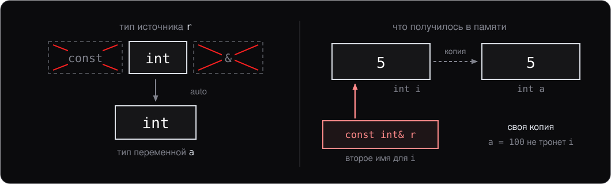
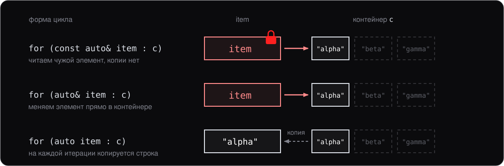
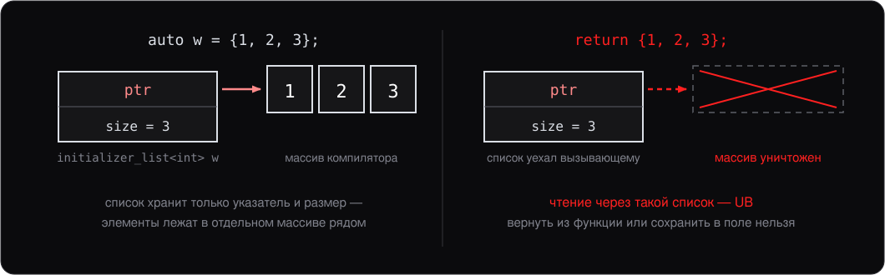
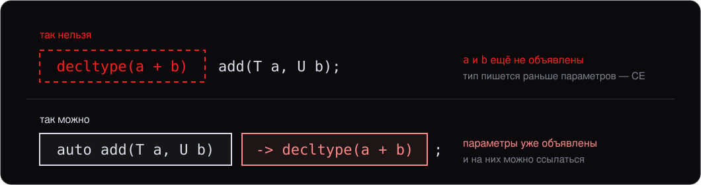
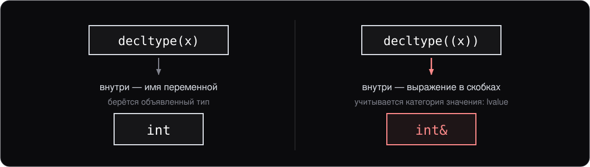
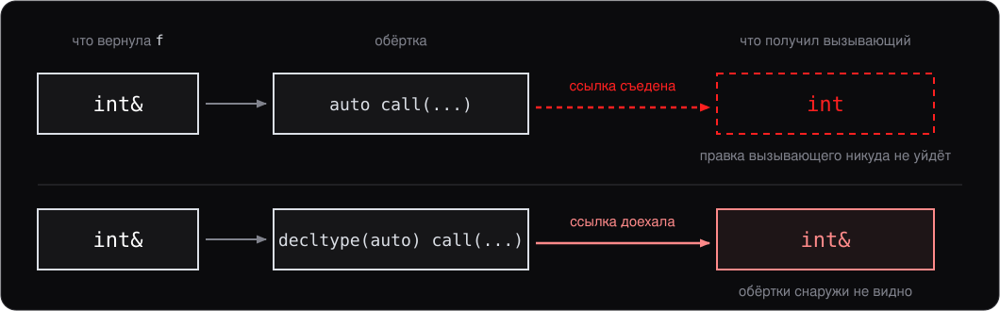

<style>
section {
    font-size: 25px;
}
</style>

<!-- _class: lead -->

# Лекция 12.

## `auto` и `decltype`: кто пишет типы

---

# План

Мы уже писали `auto` в циклах и для лямбд, не задумываясь. Сегодня разберёмся, **что именно** делает компилятор — и обнаружим, что он делает не совсем то, чего мы ждём.

1. `auto` — передаём работу компилятору
2. Что `auto` теряет по дороге
3. `auto` за пределами переменных
4. `decltype` — когда нужен точный тип
5. `decltype(auto)` — синтез

---
<!-- header: 1. auto -->

# 1. `auto` — передаём работу компилятору

C++ требует писать типы. Иногда это полезно, иногда — шум:

```cpp
std::vector<std::pair<std::string, int>>::const_iterator it = v.begin();
```

Тип здесь **не несёт информации**: он полностью определён правой частью. `auto` просит компилятор вывести его сам:

```cpp
auto it = v.begin();     // тот же тип, в пять раз короче
```

---

## Три случая, где `auto` уместен

- **Тип определён правой частью.** Писать полное имя незачем.
- **Тип невыразим.** У лямбды нет имени типа (лекция 10) — без `auto` её не сохранить.
- **Тип может измениться.** Поменяли `vector` на `deque` — код с `auto` подстроился сам.

```cpp
auto lambda = [](int x) { return x * 2; };   // иначе никак
auto sum = compute();                        // тип следует за compute
```

---

## Как это работает

`auto` — **не** «динамический тип». Тип фиксируется на этапе компиляции, просто его пишет компилятор, а не вы.

Механизм ровно тот же, что вывод `T` в шаблонной функции (лекция 9):

```cpp
template <typename T> void f(T param);
f(expr);           // T выводится из expr

auto x = expr;     // тип x выводится по тем же правилам
```

Это не аналогия — в стандарте это **буквально одни и те же правила**.

---
<!-- header: 2. Что auto теряет -->

# 2. Что `auto` теряет по дороге

`auto` не копирует тип выражения «как есть» — он его **упрощает**:

```cpp
int i = 5;
const int& r = i;

auto a = r;        // int  —  ни const, ни ссылки!
a = 100;           // ok, меняем свою копию — i не тронут
```

Ждали ссылку — получили копию, и компилятор не предупредит.

---

## Копия, а не ссылка



`a` — новая переменная, а не второе имя для `i`: ограничения источника к ней не относятся.

---

## Восстанавливаем то, что нужно

`auto` сам по себе всегда даёт **значение**. Ссылку и const запрашивают явно:

```cpp
int i = 5;
const int ci = 10;

auto  x = ci;        // int          — копия
auto& y = i;         // int&         — ссылка
const auto& z = ci;  // const int&   — ссылка на const
auto* p = &i;        // int*         — указатель
```

Отсюда три идиомы для циклов, которые нужно различать не задумываясь.

---

## Три идиомы цикла

```cpp
for (const auto& item : c) { /* читаем, не копируем */ }
for (auto& item : c)       { /* меняем на месте */ }
for (auto item : c)        { /* нужна своя копия */ }
```



`const auto&` — правильный дефолт для чтения.

---

## Второй сюрприз: фигурные скобки

```cpp
auto x = 5;              // int
auto y(5);               // int
auto z{5};               // int  (с C++17; до этого — initializer_list!)
auto w = {1, 2, 3};      // std::initializer_list<int>  ← не то, что ждали
```

Последняя строка — классическая ловушка: рассчитывают получить массив или вектор.

**Правило:** `auto x = expr;` либо `auto x = T{...};` с явным `T`. Фигурные скобки сразу после `auto` — почти всегда ошибка.

---

## Чем владеет `initializer_list`



Ничем: список хранит указатель и размер, а элементы лежат в массиве, который создал компилятор. Пока `w` рядом с ним — всё честно.

---
<!-- header: 3. auto для функций -->

# 3. `auto` за пределами переменных

Возвращаемый тип тоже можно доверить компилятору (C++14):

```cpp
auto sum(int a, int b) {
    return a + b;                 // компилятор видит: int
}

template <typename T, typename U>
auto add(T a, U b) {
    return a + b;                 // тип зависит от T и U
}
```

Цена: тело функции должно быть **видно в точке вызова**. На практике — определение в заголовке. Поэтому `auto`-возврат живёт у `inline` и шаблонных функций.

---

## Trailing return type

Тип можно написать **после** параметров — и тогда он видит их имена:

```cpp
auto sum(int a, int b) -> int { return a + b; }

template <typename T, typename U>
auto add(T a, U b) -> decltype(a + b);     // выражаем тип через a и b
```



---

## `auto` в параметрах (C++20)

```cpp
auto add(auto a, auto b) { return a + b; }
```

Это **сокращённая запись шаблона** — компилятор разворачивает в:

```cpp
template <typename T, typename U>
auto add(T a, U b) { return a + b; }
```

С концептами (concepts) получается компактное ограничение:

```cpp
auto sum(std::integral auto a, std::integral auto b) { return a + b; }
sum(2.0, 3.0);       // CE: double не integral
```

Концепты подробно в курсе не разбираются.

---
<!-- header: 4. decltype -->

# 4. `decltype` — когда нужен точный тип

Вернёмся к проблеме из раздела 2: `auto` **упрощает** тип. Иногда это ровно то, чего мы не хотим.

`decltype(expr)` даёт тип выражения **без упрощений** — со ссылками и const:

```cpp
int x = 5;
const int& r = x;

auto        a = r;   // int         — упрощено
decltype(r) b = x;   // const int&  — точно как у r
```

Два инструмента для двух задач: `auto` — «дай мне значение», `decltype` — «дай мне ровно этот тип».

---

## Задача 1: назвать тип замыкания

У типа замыкания (closure type) нет имени. Но иногда тип нужен **как шаблонный аргумент**:

```cpp
auto cmp = [](int a, int b) { return a > b; };

std::set<int, decltype(cmp)> s(cmp);
std::priority_queue<int, std::vector<int>, decltype(cmp)> q(cmp);
```

Написать имя типа замыкания нельзя, а `decltype(cmp)` — можно. Это самое частое применение `decltype` в прикладном коде.

---

## Задача 2: тип из выражения в шаблоне

```cpp
template <typename Container>
auto first(const Container& c) -> decltype(c[0]) {
    return c[0];
}
```

Возвращаем **ровно то**, что даёт `c[0]`: у `vector<int>` это `int&`, у `vector<bool>` — прокси-объект.

Написать это руками нельзя — тип зависит от `Container`, который станет известен только при инстанцировании (instantiation).

---

## Подвох: имя или выражение

```cpp
int x = 5;

decltype(x)   a;      // int   — «тип переменной x»
decltype((x)) b = x;  // int&  — «тип выражения (x)»
```



На практике этим не пользуются, но знать стоит: иначе однажды упрётесь в необъяснимую ошибку.

---
<!-- header: 5. decltype(auto) -->

# 5. `decltype(auto)` — синтез

Сложилась неудобная ситуация:

- **`auto`** удобно пишется, но **теряет** ссылки
- **`decltype(expr)`** точен, но требует **повторить выражение**

```cpp
int& get_ref();

auto a = get_ref();            // int — ссылка потеряна
decltype(get_ref()) b = ...;   // точно, но выражение дублируется
```

`decltype(auto)` берёт лучшее от обоих: «выведи тип, как это сделал бы `decltype`, но по инициализатору».

---

## Как это выглядит

```cpp
int x = 5;
int& get_ref() { return x; }

auto           a = get_ref();   // int   — копия
decltype(auto) b = get_ref();   // int&  — ссылка сохранена

b = 100;                         // меняем x!
```

Синтаксис от `auto` — выражение не дублируется; правила вывода от `decltype` — ничего не теряется.

---

## Прозрачная обёртка

Обёртка обязана вернуть ровно то, что вернула обёрнутая функция:

```cpp
template <typename F, typename... Args>
decltype(auto) call(F&& f, Args&&... args) {
    return std::forward<F>(f)(std::forward<Args>(args)...);
}
```



---
<!-- header: Итоги -->

# Итоги лекции

| Нужно | Пишем |
|---|---|
| Значение, тип очевиден справа | `auto` |
| Читать, не копируя | `const auto&` |
| Менять на месте | `auto&` |
| Точный тип выражения (назвать лямбду) | `decltype(expr)` |
| Вернуть ровно то, что вернул вызов | `decltype(auto)` |

---

## Главная мысль

`auto` и `decltype` решают **разные** задачи, и путать их дорого:

- **`auto`** — «мне нужно значение, тип посчитай сам». Отбрасывает `const` и `&` — это **фича**, но о ней нужно помнить.
- **`decltype`** — «мне нужен ровно этот тип». Сохраняет всё.
- **`decltype(auto)`** — `auto`-синтаксис с `decltype`-точностью. Для обёрток.

Плюс два подвоха, на которых спотыкаются: `auto w = {1,2,3}` даёт `initializer_list`, а `decltype((x))` — ссылку.

---

# Дальше

Следующая лекция — **итераторы, контейнеры и алгоритмы**:

- Итератор как обобщённый указатель, категории
- `range-based for` под капотом
- Обзор контейнеров: что использовать когда
- Structured bindings при обходе `map`
- Алгоритмы `<algorithm>` + лямбды, erase-remove idiom
- `ranges` (C++20) — упоминание
