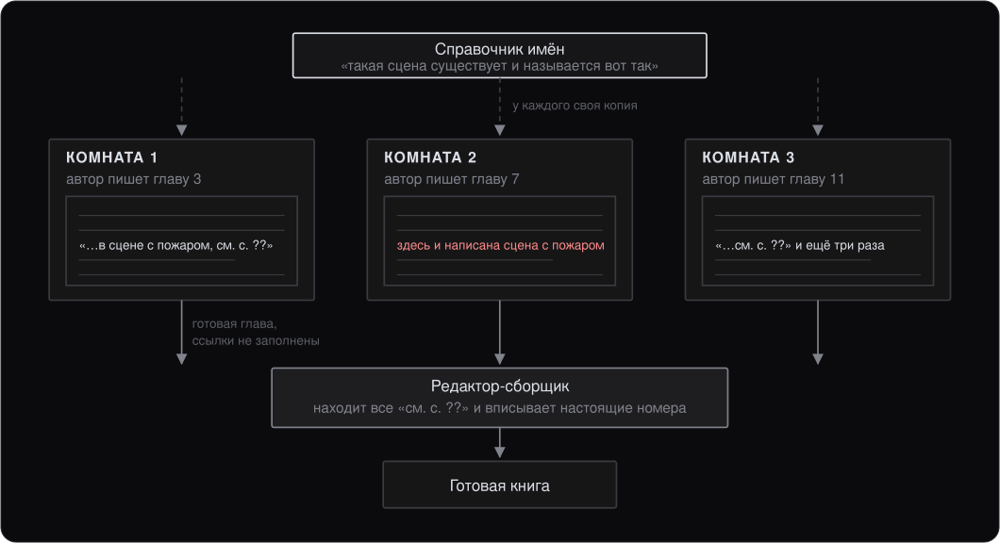
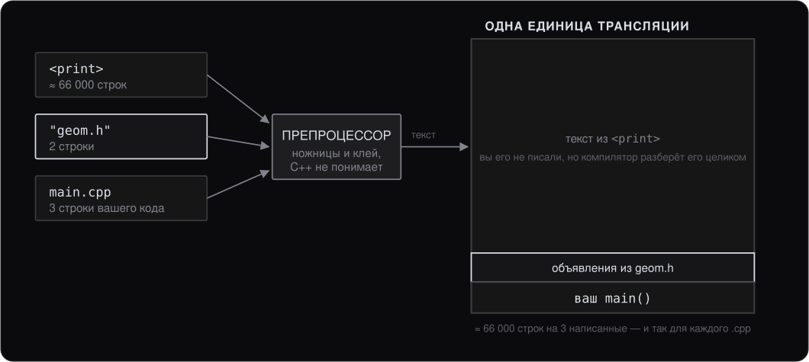

# Как C++ собирает программу

> Дополнительный материал курса: конспект для самостоятельного чтения. Слайдов к нему нет — он не читается на паре, а разворачивает то, что лекция 1 проходит коротко: препроцессор, единицы трансляции, объявления и определения, линкер.

## 0. О чём этот материал

Заголовки, единицы трансляции, объявления, определения, препроцессор, линкер — это не шесть независимых сложностей, которые надо запомнить по отдельности. Это одно решение, принятое в семидесятых, и пять его последствий. Пока решение не названо, каждое последствие выглядит произволом: почему объявление отдельно от определения, почему `#include` — это не импорт, почему компилятор молчит, а падает линкер, почему одна и та же ошибка в одном проекте лечится `#pragma once`, а в другом — строчкой в `CMakeLists.txt`.

Ключ ко всему один:

> Компилятор C++ никогда не видит вашу программу целиком. Он видит по одному файлу — и полностью забывает его, прежде чем взять следующий.

Одна команда `g++ main.cpp -o app` прячет три разные программы, которые ничего не знают друг о друге и ругаются по-разному:

- **препроцессор** — вклеивает текст заголовков в ваш файл; получается одна длинная простыня;
- **компилятор** — переводит эту простыню в машинный код, а чужие адреса оставляет прочерками;
- **линкер** — складывает все файлы и вписывает адреса в прочерки; не нашёл — сборки нет.

Разбираем по порядку: зачем программу вообще разрезали на части, что делает каждый из трёх этапов, чем управляют `extern` и `static`, по тексту ошибки определяем, кто из троих ругается, и чем эта модель обходится.

К концу чтения вы должны:

- объяснять разницу между объявлением и определением и понимать, почему определение во всей программе ровно одно;
- по тексту ошибки сборки называть этап, на котором она возникла, не открывая код;
- знать, что кладут в `.h`, а что в `.cpp`, и почему;
- уметь посмотреть на объектный файл своими глазами: что он предоставляет и что требует.

Материал не вводит новых конструкций языка: он объясняет модель, внутри которой работает всё остальное в курсе.

## 1. Издательство, где авторы не разговаривают друг с другом

Книгу пишут пятьдесят авторов. Каждый сидит в своей комнате и чужих глав не видит.



Вся модель сборки C++ уложена в эту картинку, и дальше остаётся только подставить термины:

| В издательстве | В C++ |
|---|---|
| Комната автора | [Единица трансляции](../../glossary.md#translation-unit) (translation unit) |
| Справочник имён | Заголовочный файл `.h` |
| Готовая глава | Объектный файл `.o` |
| Прочерк «см. с. ??» | Незаполненный адрес — [релокация](../../glossary.md#relocation) (relocation) |
| Редактор-сборщик | [Линкер](../../glossary.md#linker) (linker) |

**Единица трансляции** — один `.cpp` после того, как препроцессор вклеил в него все заголовки. Это и есть та комната, за пределы которой компилятор не выходит.

## 2. Зачем программу вообще разрезают на части

Кажется, проще отдать компилятору всё разом — так и работают Python, Java, Rust. C++ выбрал другое, и не по недосмотру.

- **1970-е. Программа не влезала в память.** У машины, на которой родился C, были десятки килобайт памяти. Компилятор физически не мог держать в голове всю программу — только один файл за раз.
- **Экономика. Правка в одной строке не должна стоить получаса.** Файлы собираются независимо — значит, после правки пересобирается только один. Десятки раз в день.
- **Практика. Библиотеку можно отдать без исходников.** Готовые главы (`.o`, `.a`, `.so`) уже скомпилированы — чтобы ими пользоваться, хватит заголовка.


Третий пункт вы уже видели, не зная об этом. В комплекте практикума лежат `include/os.h` и `include/edr.h` — заголовки, — и собранные библиотеки в `lib/`. Исходников симулятора у вас нет и не будет, а писать агента, который с ним линкуется, это не мешает: заголовка достаточно, чтобы компилятор проверил каждый ваш вызов. Ровно так же распространяется любая закрытая библиотека.

Первая причина устарела, вторая и третья — нет. Заголовки, объявления, линкер — это техника, которой оплачены дешёвая пересборка и поставка библиотек без кода.

## 3. Что происходит между `g++ main.cpp` и запуском

Дальше — пример из трёх файлов, который мы проведём через все три этапа.

```cpp
// geom.h — ОБЪЯВЛЕНИЕ
#pragma once
double area(double r);      // только обещание: такая функция есть
```

```cpp
// geom.cpp — ОПРЕДЕЛЕНИЕ
#include "geom.h"
double area(double r) { return 3.14159 * r * r; }
```

```cpp
// main.cpp — ИСПОЛЬЗОВАНИЕ
#include <print>
#include "geom.h"
int main() { std::print("{}\n", area(2.0)); }
```

Собирается это одной командой, и она же скрывает всю дальнейшую механику:

```
g++ -std=c++23 -Wall -Wextra main.cpp geom.cpp -o app
```

### Препроцессор — ножницы и клей

`#include` — не «импортировать модуль», а «вклей сюда текст этого файла». Препроцессор не понимает C++: он умеет вклеивать файлы, подставлять макросы и выкидывать куски по `#ifdef`.



Из трёх строк `main.cpp` получаются десятки тысяч, и именно их увидит компилятор — заново для каждого `.cpp`. Замеряется одной командой:

```
g++ -std=c++23 -E main.cpp | wc -l
```

Отсюда два следствия, которые в лекции 1 даны как готовые правила. Первое — `#pragma once`: один заголовок легко приезжает в файл дважды разными путями, и без защиты его содержимое окажется в единице трансляции в двух экземплярах. Второе — «в заголовке держим минимум»: заголовок стоит столько раз, сколько файлов его включили.

### Компилятор — работает в комнате с закрытой дверью

Компилятор берёт одну единицу трансляции — и всё. Он не пойдёт искать тело `area` в `geom.cpp`: он вообще не знает, что тот существует.

Чем тогда он проверяет вызов `area(2.0)`? Здесь появляется разделение, которое чаще всего путают.

**Объявление — «такое имя есть, вот его тип».** `double area(double);` — пропуск с фотографией: имя, что принимает, что возвращает. Этого хватает, чтобы проверить типы и сгенерировать вызов. Объявлений может быть сколько угодно, хоть в каждом файле.

**Определение — «вот сам код».** Тело в фигурных скобках — уже человек, а не пропуск. Оно занимает место в объектном файле. Во всей программе оно должно быть ровно одно — это и есть **[ODR](../../glossary.md#odr)** (One Definition Rule; по-русски — правило одного определения).

Вызов компилятор сгенерировать может, а адрес подставить — нет: `area` живёт в другом файле, и где она окажется в итоговой программе, из этой комнаты не видно. Значит, он оставляет в машинном коде прочерк и запись «мне нужен `area(double)`, пусть впишут потом».

Результат — **объектный файл**: машинный код плюс две таблицы, «предоставляю» и «требуется». В документации инструментов они называются определёнными (defined) и неопределёнными (undefined) символами.


Обе таблицы видны глазами:

```
g++ -std=c++23 -c main.cpp        # остановиться после компиляции, получить main.o
nm -C --defined-only main.o       # список «предоставляю»
nm -C --undefined-only main.o     # список «требуется»
```

### Линкер — единственный, кто видит всё

Линкер не знает C++ — ни типов, ни классов, ни [пространств имён](../../glossary.md#namespace) (namespace). Для него есть только файлы и два списка у каждого: «предоставляю» и «требуется». Работа механическая: для каждого «требуется» найти ровно одно «предоставляю» и вписать адрес в прочерк.

Исходов три:

- нашёл ровно одно — собрал;
- не нашёл — `undefined reference`;
- нашёл два — `multiple definition`: выбирать он не имеет права.


Компилятор при этом молчит совершенно законно: в его комнате всё было в порядке.

## 4. `extern` и `static`: две ручки таблицы символов

У функций видно на глаз: есть тело — определение, нет тела — объявление. У переменных не видно. `int counter;` — это уже определение: место выделено, символ выложен в таблицу «предоставляю». «Просто объявления» переменной обычным синтаксисом не написать — для этого и есть `extern`.

`extern int counter;` — то же обещание, что и у функций, только для данных: «переменная где-то есть, место выделит другой файл». Значит, схема такая: `extern` в заголовке, определение — ровно в одном `.cpp`.

`static` на верхнем уровне файла — парная ручка, с обратным смыслом: «в общую таблицу не выкладывать». Линкер такого символа не увидит вовсе, и одноимённые `static`-символы в разных файлах друг с другом не столкнутся.


Одно и то же имя, три судьбы. Ни `extern`, ни `static` на верхнем уровне файла не говорят ничего про [время жизни](../../glossary.md#lifetime) (lifetime): они решают ровно одно — попадёт ли символ в таблицу, которую увидит линкер.

### Три уточнения

- `extern double area(double);` — у функций слово избыточно: объявление без тела и так значит «определение в другом файле».
- `static` **внутри функции** — совсем другой смысл: переменная живёт между вызовами и хранится в статической памяти (лекция 2). Про видимость для линкера — только на верхнем уровне файла.
- `const double kPi = 3.14159;` в заголовке — безопасно: у `const` на верхнем уровне [internal linkage](../../glossary.md#linkage) (по-русски — внутреннее связывание), у каждой единицы трансляции своя копия, сталкиваться нечему. Начиная с C++17 то же самое для любых переменных даёт `inline`.

### Имя символа и `extern "C"`

Есть ещё один `extern`, и он про другое — не про место переменной, а про то, под каким именем символ попадёт в таблицу.

Линкер не знает ни [перегрузки](../../glossary.md#overload) (overloading), ни пространств имён. А в C++ функций с именем `area` может быть несколько, и различаются они типами параметров. Чтобы линкеру было что различать, компилятор кодирует [сигнатуру](../../glossary.md#signature) (signature) прямо в имя символа — это **[name mangling](../../glossary.md#name-mangling)** (по-русски — искажение имён):

- `double area(double)` лежит в таблице как `_Z4aread`;
- `extern "C" double area(double)` лежит как `area` — но перегрузить такую функцию уже нельзя, имя в таблице одно.

Отсюда странные имена в сообщениях линкера, и отсюда же ключ `-C` у `nm` — «покажи имена по-человечески».

`extern "C"` нужен там, где по обе стороны линкера разные языки: библиотека на C, функция, которую дёргает Python, вызов системного API. В курсе это встретится дважды: в лекции 10, где лямбда протаскивается в C-API через [трамплин](../../glossary.md#trampoline) (trampoline), и в лекции 14, где разбираются границы с C-кодом целиком.

## 5. Кто из троих ругается

Сообщение почти всегда говорит, на каком этапе всё встало. Это половина диагноза, и она достаётся бесплатно — до открытия кода.

- `'area' was not declared in this scope` — **компилятор.** В этой единице трансляции нет объявления. Забыт `#include "geom.h"` — в комнату не выдали справочник.
- `undefined reference to 'area(double)'` — **линкер.** Объявление было, компилятор поверил. Определения линкеру не дали: `geom.cpp` не в сборке — или сигнатура разошлась (`double` против `float`), и требуется символ, которого никто не предоставляет.
- `multiple definition of 'area(double)'` — **линкер.** Определение положили в заголовок, а заголовок включили в два `.cpp` — две главы предоставляют одно и то же. Нарушен ODR.
- `redefinition of 'struct Point'` — **компилятор.** Один заголовок вклеился дважды внутрь одной единицы трансляции. Не хватает `#pragma once`.
- `cannot find -lfoo` — **линкер.** Библиотеку велели взять, но по путям поиска её нет. Это ещё до символов: не найден сам файл.

Тексты приведены по GCC; clang и MSVC формулируют иначе, но этап определяется так же — по тому, говорит компилятор про имена и типы или линкер про символы и адреса.

**Посмотреть каждый этап своими глазами.** Команды даны для Linux или WSL; в родной сборке под Windows вместо `nm` тот же вывод даёт `llvm-nm`.

```
g++ -std=c++23 -E main.cpp | wc -l   # сколько строк реально получил компилятор
g++ -std=c++23 -c main.cpp           # остановиться после компиляции, получить main.o
g++ -std=c++23 -c geom.cpp           # то же для второго файла
nm -C --undefined-only main.o        # список «требуется»
nm -C --defined-only geom.o          # список «предоставляю»
g++ main.o geom.o -o app             # только линковка
```

Полезно проделать это один раз руками — дальше `undefined reference` перестаёт быть загадкой и становится вопросом «а этот файл вообще попал в сборку?».

## 6. Чем эта модель обходится

За дешёвую пересборку заплачено, и счёт видно каждый день.

- **Договор существует в двух копиях.** Сигнатура написана и в `.h`, и в `.cpp`. Разъедутся — узнаете от линкера, а не от компилятора: тот, кто видит оба файла, уже не понимает C++.
- **Заголовок разворачивается 500 раз.** Долгая сборка C++ — почти целиком цена вклейки текста. Отсюда предкомпилированные заголовки и unity build.
- **Порядок вклейки влияет на смысл.** Макрос, определённый выше, действует на всё, что вклеено ниже. Один и тот же заголовок в разных файлах может развернуться по-разному.

Это и чинят модули C++20: интерфейс компилируется один раз и подключается уже разобранным. Три этапа остаются, исчезает копипаст текста. Поддержка в компиляторах и [системах сборки](../../glossary.md#build-system) (build system) пока неровная, в курс модули не входят, и работать вы будете с моделью на заголовках — той, на которой написано подавляющее большинство существующего кода.

## 7. Семь правил, которые следуют из всего сказанного

1. В `.h` — объявления, в `.cpp` — определения. Заголовок — справочник имён, а не место для кода.
2. Первая строка любого заголовка — `#pragma once`. Она защищает от двойной вклейки в одну единицу трансляции.
3. Создали новый `.cpp` — добавьте его в сборку. Линкер видит только то, что ему передали.
4. Сначала определите, кто ругается. Компилятор говорит про имена и типы, линкер — про символы и адреса.
5. `#include` — не импорт, а вклейка текста. Не включайте в заголовок то, без чего он обходится.
6. Определение во всей программе — ровно одно. Хотите тело в заголовке — сделайте его `inline`.
7. Глобальная переменная: `extern int x;` в заголовке, `int x = 0;` ровно в одном `.cpp`.

## 8. Четыре вопроса, на которых всё сходится

**Почему `g++ main.cpp -o app` без `geom.cpp` даёт ошибку линкера, а не компилятора?**
Компилятор увидел объявление в `geom.h`, проверил типы и успокоился: откуда обещание исполнится — не его дело. Он оставил прочерк. Отсутствие тела обнаружил линкер — он единственный видит таблицы всех файлов.

**Что будет, если написать тело `area` прямо в `geom.h` и включить заголовок в два разных `.cpp`?**
Оба `.cpp` скомпилируются без жалоб: в своей комнате всё законно. Но у обоих в таблице «предоставляю» окажется `area(double)` — `multiple definition`. Слово `inline` — это разрешение линкеру увидеть много одинаковых копий и оставить одну.

**Почему проект из 500 файлов, включающих один тяжёлый заголовок, собирается так долго?**
Потому что `#include` — вклейка текста. Компилятор 500 раз разбирает одни и те же десятки тысяч строк с нуля: между файлами он ничего не помнит.

**Почему `const double kPi = 3.14159;` в заголовке проблем не вызывает, а `int counter;` — вызывает?**
У `const` на верхнем уровне internal linkage: символ в общую таблицу не попадает, у каждого своя копия — сталкиваться нечему. У `int counter;` — external linkage, поэтому два одноимённых символа встречаются у линкера. Одна переменная на программу — это `extern` в заголовке плюс определение в одном `.cpp`.

## Итоги

- Компилятор видит **одну единицу трансляции** — `.cpp` со вклеенными заголовками — и забывает её перед следующей. Всё остальное следует отсюда.
- Раздельная компиляция выбрана ради дешёвой пересборки и поставки библиотек без исходников; за это платят заголовками, дублированием сигнатур и долгой сборкой.
- `#include` — **текстовая вклейка**, а не импорт. `#pragma once` защищает от повторной вклейки в одну единицу трансляции.
- **Объявление** — имя и тип, их может быть много. **Определение** — код или место в памяти, оно ровно одно на программу (ODR).
- Объектный файл — это машинный код и две таблицы: «предоставляю» и «требуется». Смотрятся через `nm -C`.
- Линкер механически сводит одно с другим: не нашёл — `undefined reference`, нашёл два — `multiple definition`.
- На верхнем уровне файла `extern` и `static` управляют одним: попадёт символ в общую таблицу или нет. `extern` в заголовке + определение в одном `.cpp` — единственный правильный способ завести глобальную переменную.
- `extern "C"` отключает name mangling: имя в таблице становится простым, перегрузка становится невозможной. Нужен на границе с другими языками.
- По тексту ошибки этап определяется до открытия кода: имена и типы — компилятор, символы и адреса — линкер.

## Что дальше

Материал опирается на **лекцию 1** (препроцессор, `#pragma once`, [CE](../../glossary.md#ce) (compilation error), [RE](../../glossary.md#re) (runtime error) и [UB](../../glossary.md#ub) (undefined behavior)) и подпирает несколько последующих:

- **лекция 3** — `inline` и перегрузка функций: почему тело в заголовке требует `inline` и как перегрузка выглядит со стороны таблицы символов;
- **лекция 4** — классы: объявление класса в заголовке, определения методов в `.cpp`;
- **лекция 8** — шаблоны: единственное крупное исключение из правила «в заголовке нет кода», и после этого конспекта понятно, почему исключение понадобилось;
- **лекция 10 и лекция 14** — границы с C-API, где `extern "C"` работает по-настоящему.
