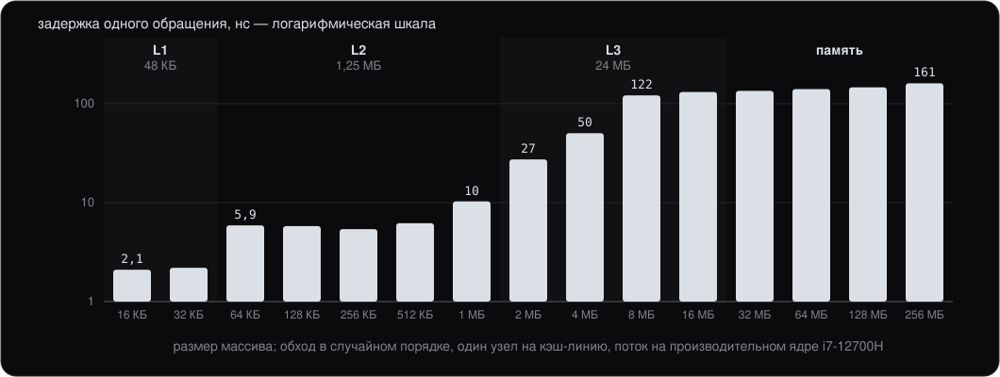
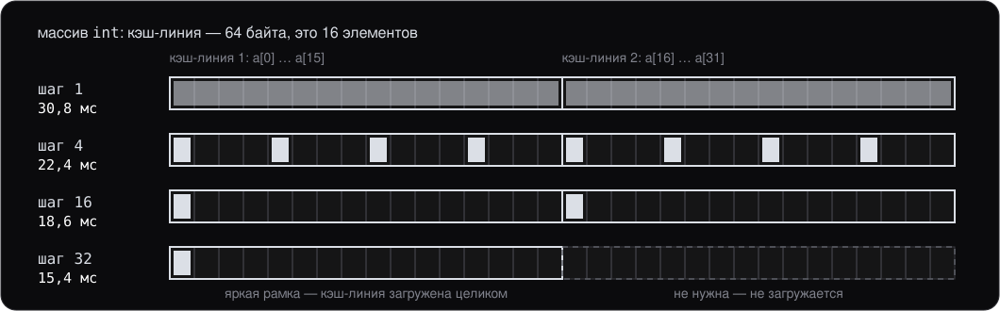
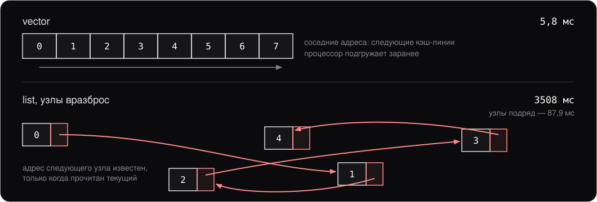
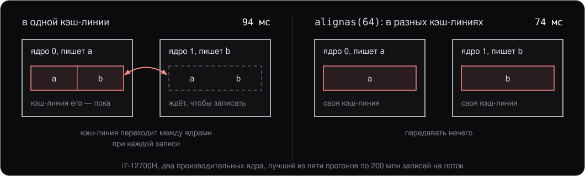

# Кэш процессора

> Дополнительный материал курса: конспект для самостоятельного чтения. Слайдов к нему нет — он не читается на паре, а объясняет, почему `std::vector` обгоняет `std::list` там, где асимптотика обещает обратное, и почему два потока, каждый со своей переменной, могут мешать друг другу. Продолжает материал [«Память процесса изнутри»](../process-memory/notes.md): там — как память выделяется, здесь — как быстро до неё добраться.

## 0. О чём этот материал

Лекция 13 выбирает контейнер по таблице сложностей: вставка в середину `std::list` — `O(1)`, в середину `std::vector` — `O(n)`. Таблица верна, но на настоящем железе `vector` часто выигрывает и там, где по ней должен проиграть, — причём в разы. Лекция 2, раздел 4, говорит о цене связного списка тем же языком: узлы разбросаны по памяти. Этот материал показывает, почему разбросанность стоит так дорого.

Причина одна: память медленнее процессора в сотню раз, и между ними стоят **кэши** — маленькая быстрая память, куда процессор складывает то, что недавно трогал. Программа, которая обращается к памяти так, как кэшам удобно, работает быстро; программа с той же асимптотикой, но с другим порядком обращений, — в десятки раз медленнее. Асимптотика считает операции, а время уходит на ожидание памяти.

К концу чтения вы должны:

- знать уровни кэшей и порядок их задержек, уметь объяснить, откуда берутся ступени;
- понимать, что такое кэш-линия и почему соседние данные достаются бесплатно;
- объяснять, почему обход `list` и обход матрицы по столбцам медленнее в десятки раз;
- понимать, что такое false sharing и как его убрать;
- знать несколько привычек, которые делают код дружелюбным к кэшу.

Все числа сняты на одной машине: Intel Core i7-12700H, Windows 11, clang 19 с `-O2`. На другой машине они будут другими, соотношения — похожими. Замеры — своим стендом на `std::chrono::steady_clock`; каждое число — лучший из нескольких прогонов.

## 1. Иерархия памяти

Процессор выполняет несколько команд за такт, а такт на этой машине — около четверти наносекунды. Обращение к оперативной памяти занимает больше сотни наносекунд — сотни тактов, за которые ядро могло бы сделать тысячу операций. Чтобы ядро не простаивало, между ним и памятью стоят кэши трёх уровней: чем ближе к ядру, тем меньше и быстрее.

Что именно стоит в этом процессоре, сообщает сама Windows (`GetLogicalProcessorInformationEx`):

```
L1 данные       48 КБ, строка 64 байт, таких 6
L1 данные       32 КБ, строка 64 байт, таких 8
L2 общий      1280 КБ, строка 64 байт, таких 6
L2 общий      2048 КБ, строка 64 байт, таких 2
L3 общий     24576 КБ, строка 64 байт, таких 1
```

Процессор гибридный: шесть производительных ядер (P-cores) и восемь энергоэффективных (E-cores). У каждого производительного ядра свои L1 на 48 КБ и L2 на 1,25 МБ; энергоэффективные собраны в две группы по четыре, у каждой группы общий L2 на 2 МБ. L3 на 24 МБ — один на всех. И везде одно и то же число: [кэш-линия](../../glossary.md#cache-line) (cache line) — 64 байта. Про неё раздел 3.

Гибридность пришлось учитывать и в замерах: поток, который система переносит с одного типа ядра на другой, меряет то одно, то другое. Поэтому в опытах ниже потоки закреплены за производительными ядрами.

## 2. Лестница задержек

Чтобы увидеть уровни, программа обходит массивы разного размера, от 16 КБ до 256 МБ, **в случайном порядке** и меряет одно обращение. Каждый элемент массива хранит индекс следующего и занимает целую кэш-линию — так каждое обращение приходится на новую кэш-линию, а процессор не может угадать, куда пойдёт обход дальше:

```cpp
struct alignas(64) Slot {
    std::uint32_t next;
};

for (std::size_t i = 0; i < kSteps; ++i) {
    at = slots[at].next;  // следующий адрес известен только после чтения
}
```



| Размер массива | Задержка | Где лежит |
|---|---|---|
| 16–32 КБ | 2,1–2,2 нс | L1 |
| 64–512 КБ | 5,4–6,2 нс | L2 |
| 1 МБ | 10,3 нс | край L2 |
| 2–4 МБ | 27–50 нс | L3 |
| 8–256 МБ | 122–161 нс | оперативная память |

Ступени видны сразу: пока массив помещается в уровень, задержка почти не зависит от размера, а на границе уровня прыгает. От L1 до памяти — в семьдесят раз.

Ступень L3 размыта: по размеру ей бы тянуться до 24 МБ, а задержка памяти начинается уже с 8 МБ. Дело в ещё одном кэше — **[TLB](../../glossary.md#tlb)** (translation lookaside buffer). Каждый [виртуальный адрес](../../glossary.md#virtual-memory) (virtual address) надо перевести в физический по таблице страниц (материал про память процесса, раздел 1), и процессор держит недавние переводы в TLB. При случайном обходе большого массива каждая страница новая, перевода в TLB нет, и к [промаху кэша](../../glossary.md#cache-miss) (cache miss) данных добавляется поход в таблицу страниц. Отсюда же разброс чисел на больших размерах от прогона к прогону.

## 3. Кэш-линия

Кэш обменивается с памятью не байтами, а **кэш-линиями** (cache line) по 64 байта. Попросили один `int` — в кэш приехали 64 байта вокруг него, то есть ещё пятнадцать соседей.

Это видно по опыту, который обходит массив в 256 МБ с разным шагом и умножает каждый затронутый элемент на три:

```cpp
for (std::size_t i = 0; i < kN; i += stride) {
    a[i] *= 3;
}
```

| Шаг | Обращений | Время |
|---|---|---|
| 1 `int` (4 байта) | 67 млн | 30,8 мс |
| 2 | 33 млн | 25,5 мс |
| 4 | 16 млн | 22,4 мс |
| 8 | 8 млн | 20,1 мс |
| 16 (64 байта) | 4 млн | 18,6 мс |
| 32 (128 байт) | 2 млн | 15,4 мс |
| 64 (256 байт) | 1 млн | 8,9 мс |
| 128 (512 байт) | 0,5 млн | 4,0 мс |



От шага 1 до шага 16 обращений стало в шестнадцать раз меньше, а время упало меньше чем вдвое: в каждом случае загружается **каждая** кэш-линия массива, и почти всё время уходит на это. После 64 байт кэш-линии начинают пропускаться, и время падает вслед за их числом.

Два следствия для кода.

- **Соседние данные достаются бесплатно.** Если программа прочитала поле объекта, соседние поля уже в кэше. Поэтому поля, которые читаются вместе, стоит держать вместе, а объект — компактным: чем меньше `sizeof`, тем больше объектов в одной кэш-линии. Порядок полей и [выравнивание](../../glossary.md#alignment) (alignment), от которых зависит `sizeof`, — лекция 6, раздел 3.
- **Читать один байт из кэш-линии — платить за все 64.** Обход, который из каждой кэш-линии берёт мало, тратит память впустую.

## 4. Предвыборка: почему `list` медленнее `vector`

Задержка памяти в 150 нс не означает, что каждое обращение к памяти столько стоит. Процессор следит за адресами, к которым обращается программа, и если видит закономерность — например, адрес растёт на одну и ту же величину, — начинает подгружать следующие кэш-линии **заранее**, пока программа занята текущими. Это **[предвыборка](../../glossary.md#prefetch)** (prefetch). При последовательном обходе данные приезжают к моменту, когда они нужны, и задержка памяти почти не видна.

Предвыборке нужны две вещи: чтобы адрес следующего обращения был предсказуем и чтобы его можно было вычислить, не дожидаясь текущего. У `std::vector` есть обе. У `std::list` — ни одной: адрес следующего узла лежит в текущем узле, и узнать его можно, только дождавшись чтения.



Сумма десяти миллионов `int`:

| Контейнер | Время |
|---|---|
| `std::vector<int>` | 5,8 мс |
| `std::list<int>`, узлы выделены подряд | 87,9 мс |
| `std::list<int>`, узлы вразброс | 3508 мс |

Во втором случае список построен из вектора по порядку, и [аллокатор](../../glossary.md#allocator) (allocator) положил узлы почти подряд — предвыборка отчасти срабатывает. В третьем узлы выделены в случайном порядке значений, а обходятся по возрастанию (список отсортирован методом `sort`, который переставляет не узлы, а указатели), и каждый следующий узел оказывается в случайном месте памяти. Это ровно опыт из раздела 2, только на настоящем контейнере: шестьсот раз медленнее вектора.

Третий случай не надуман. Список, который долго живёт, в который вставляют и из которого удаляют, со временем приходит именно в такое состояние: узлы, соседние по списку, выделены в разное время и лежат где попало.

Двумерный массив даёт тот же эффект без всяких указателей. Матрица 4096 × 4096 `int` хранится по строкам, одним вектором:

```cpp
sum += matrix[r * kSide + c];  // r — строка, c — столбец
```

Обход по строкам — внутренний цикл по `c` — идёт по соседним адресам: 11,6 мс. Обход по столбцам — внутренний цикл по `r` — прыгает на 16 КБ за шаг, каждое обращение попадает в новую кэш-линию и почти всегда в новую страницу: 521 мс, в сорок пять раз медленнее. Код отличается только порядком двух `for`.

## 5. `vector` против `list` на вставке

Самый показательный случай — тот, где асимптотика прямо на стороне списка. Последовательность надо держать отсортированной, и числа приходят по одному: найти место линейным поиском и вставить.

```cpp
for (int v : values) {
    auto it = std::find_if(c.begin(), c.end(), [v](int x) { return x >= v; });
    c.insert(it, v);
}
```

Для `list` вставка в найденное место — `O(1)`, для `vector` — `O(n)`: все элементы правее сдвигаются. Результат:

| Элементов | `vector` | `list` |
|---|---|---|
| 1 000 | 0,2 мс | 0,5 мс |
| 10 000 | 9,7 мс | 132,5 мс |
| 50 000 | 574 мс | 13 307 мс |

Вектор быстрее в двадцать с лишним раз. Асимптотика не ошиблась, она просто считает не то: поиск места — `O(n)` у обоих, и у списка он в десятки раз дороже из-за раздела 4. А сдвиг элементов вектора — это копирование непрерывного куска памяти, самая быстрая операция, которая вообще бывает: последовательная, предсказуемая, по целым кэш-линиям.

**Правило:** по умолчанию — `std::vector`. Другой контейнер берут, когда он нужен по смыслу — стабильные адреса элементов, частые вставки в начало при длинной последовательности, — и когда это подтвердил замер. Лекция 13, раздел 8, приходит к тому же выводу со стороны интерфейсов.

## 6. False sharing

У каждого ядра свой L1, а память общая. Если два ядра держат в своих кэшах одну и ту же кэш-линию, и одно из них пишет, другое не должно продолжать читать старое значение. Процессор следит за этим сам: **записывать ядро может только кэш-линию, которой владеет единолично**. Перед записью оно забирает её себе, а копии у других ядер становятся недействительными.

Беда случается, когда два потока пишут **разные** переменные, лежащие в **одной** кэш-линии. Логически они друг другу не мешают — гонки нет, каждый трогает своё. Но кэш-линия одна, и она переходит от ядра к ядру при каждой записи. Это **[false sharing](../../glossary.md#false-sharing)** (по-русски — ложное разделение).



Опыт: два потока, каждый двести миллионов раз увеличивает свой счётчик. Счётчики `volatile`, чтобы каждое увеличение было настоящей записью в память, а не в регистр:

```cpp
struct Adjacent {
    volatile long long a = 0;
    volatile long long b = 0;
};

struct Separated {
    alignas(64) volatile long long a = 0;
    alignas(64) volatile long long b = 0;
};
```

```
hardware_destructive_interference_size = 64
sizeof(Adjacent) = 16, sizeof(Separated) = 128
лучший из пяти: в одной строке   94.3 мс, в разных   74.4 мс
лучший из пяти: в одной строке   97.2 мс, в разных   79.4 мс
```

Счётчики в одной кэш-линии — на четверть медленнее. На этой машине и с такой нагрузкой эффект умеренный; насколько он велик, зависит от процессора и от того, что именно делают потоки. Но он есть всегда, когда потоки часто пишут в одну кэш-линию, и он не виден в коде: две независимые переменные в соседних полях структуры выглядят совершенно безобидно.

Лечится разнесением по разным кэш-линиям. `alignas(64)` (лекция 6, раздел 3) выравнивает каждое поле на границу кэш-линии, и структура вырастает с 16 до 128 байт. Вместо числа 64 можно написать `std::hardware_destructive_interference_size` из `<new>` (C++17) — минимальное расстояние, на котором две переменные гарантированно не мешают друг другу; здесь оно равно 64.

Где это встречается. [Пул рабочих потоков](../../glossary.md#thread-pool) (thread pool), разбирающих очередь событий (лекция 15), часто ведёт статистику: сколько событий разобрал каждый поток. Естественный код — массив счётчиков, по одному на поток, — кладёт соседние счётчики в одну кэш-линию, и потоки начинают мешать друг другу ровно на той операции, которая должна быть бесплатной. Каждому потоку свою кэш-линию — или копить счёт в локальной переменной и складывать изредка.

False sharing — вопрос скорости, а не корректности: гонки здесь нет, каждый поток пишет своё. Если же два потока пишут **одну** переменную, это [гонка данных](../../glossary.md#data-race) (data race), и её закрывает синхронизация — `std::mutex` (лекция 15, раздел 6), а не выравнивание.

## 7. Привычки, которые помогают кэшу

- **Непрерывные контейнеры по умолчанию.** `std::vector`, `std::array`, `std::deque` для очередей. Узловые контейнеры — когда нужны их свойства, а не асимптотика вставки.
- **Значения, а не указатели.** `std::vector<Event>` читается подряд, `std::vector<std::unique_ptr<Event>>` — через указатели в [кучу](../../glossary.md#heap) (heap), как список. Указатели нужны для полиморфизма (лекция 7) и для стабильных адресов; в остальных случаях значения быстрее.
- **Обход в порядке хранения.** Внутренний цикл — по соседним адресам.
- **Компактные объекты.** Порядок полей, который убирает выравнивание, и отсутствие редко нужных полей в горячих структурах — больше объектов в кэш-линии.
- **Своя кэш-линия для каждого пишущего потока.** `alignas(std::hardware_destructive_interference_size)` для данных, в которые разные потоки часто пишут.
- **Мерить.** Кэш — поведение конкретного процессора, и интуиция здесь подводит. Замер со своими данными на своей машине — единственный аргумент. И помнить подвох из материала про память процесса: оптимизатор выбрасывает то, результат чего не используется, так что замер без `volatile` или печати результата легко измеряет пустоту.

## Итоги

- Память в сотню раз медленнее ядра. Между ними кэши: L1 — единицы наносекунд и десятки килобайт, L2 — около шести наносекунд и мегабайт, L3 — десятки наносекунд и десятки мегабайт, память — больше сотни наносекунд.
- Кэш работает кэш-линиями по 64 байта: соседние данные достаются бесплатно, а читать из кэш-линии один байт — платить за все.
- Предвыборка прячет задержку памяти при предсказуемом обходе. У `vector` адрес следующего элемента известен заранее, у `list` — только после чтения текущего; поэтому обход списка медленнее в пятнадцать — шестьсот раз, в зависимости от того, как разбросаны узлы.
- Обход матрицы по столбцам медленнее обхода по строкам в сорок пять раз — при той же асимптотике.
- Вставка в отсортированную последовательность у `vector` быстрее, чем у `list`, в двадцать раз, хотя асимптотика обещает обратное: поиск места дороже вставки.
- False sharing — два потока пишут разные переменные в одной кэш-линии, и она ходит между ядрами. Лечится `alignas(64)` или `std::hardware_destructive_interference_size`.
- По умолчанию — `std::vector` и значения; всё остальное — по замеру.

## Что дальше

Материал опирается на [«Память процесса изнутри»](../process-memory/notes.md) и подпирает:

- **лекцию 2**, раздел 4 — односвязный список и его цена;
- **лекцию 6**, раздел 3 — выравнивание, `alignas` и размер объекта;
- **лекцию 13**, разделы 5 и 8 — последовательные контейнеры и выбор между ними;
- **лекцию 15**, раздел 6 — потоки и общее состояние: false sharing — то, что остаётся, даже когда гонки нет.
