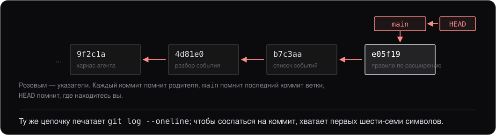

# Git: минимум на каждый день

> Дополнительный материал курса: конспект для самостоятельного чтения. Слайдов к нему нет. Здесь только то, без чего не обойтись: одна модель, шесть команд, способ отменить сделанное — и под конец о том, почему git такой быстрый. Ничего из C++ для чтения не нужно, и читать лучше до первого занятия.

## 0. О чём этот материал

Код курса вы забираете через git, обновления получаете через git, и свою работу над проектом практикума удобно вести им же. При этом сам курс про git не рассказывает ничего: предполагается, что базовые команды вы набираете не задумываясь.

Материал закрывает этот пробел. Он не про «продвинутый git», а про минимум, которого хватает надолго и который не придётся переучивать потом.

К концу чтения вы должны:

- понимать, что попадает в коммит и зачем между правкой файла и коммитом стоит ещё одна зона;
- вести историю руками: `status`, `add`, `commit`, `log`;
- заводить ветку, переключаться между ветками и сливать их;
- забирать чужие правки и отдавать свои;
- отменять сделанное, понимая, что при этом теряется, а что нет;
- в общих чертах представлять, что git делает внутри, — хотя бы затем, чтобы не удивляться, почему переключение ветки мгновенное.

Всё описанное одинаково работает на Windows, Linux и macOS: git — одна и та же программа с одними и теми же командами. Как его поставить, сказано в [`SETUP.md`](../../../SETUP.md).

## 1. Что попадает в коммит

Работа с git выглядит так: вы правите файлы, а потом говорите «вот это готово, запомни». Запомненное называется **[коммитом](../../glossary.md#commit)** (commit).

Первое, что стоит принять: **git не запоминает сам.** Он видит все ваши правки и терпеливо ждёт, но в историю не возьмёт ни одной, пока вы не скажете, какие именно. Поэтому между **[рабочим каталогом](../../glossary.md#working-tree)** (working tree) и историей стоит третья зона — **[индекс](../../glossary.md#git-index)** (index, в документации ещё staging area): отобранные правки, из которых будет собран следующий коммит.


Индекс кажется лишней сложностью ровно до первого вечера, когда вы починили две несвязанные вещи и хотите записать их разными коммитами. Без индекса `git commit` означал бы «запиши всё, что нашлось в каталоге», и в историю уезжал бы заодно файл, открытый по ошибке.

И одно свойство, ради которого всё затевается. Кладёте вы в коммит горсть правок — а получаете **точку, в которую можно вернуться:** `git checkout` на любой коммит выдаёт рабочий каталог ровно таким, каким он был тогда, со всеми файлами, включая те, которых вы в тот раз не касались. Обратное тоже верно и важнее: правка, не попавшая ни в один коммит, для git не существует и восстановлению не подлежит.

Как git ухитряется отдавать целое состояние, если вы клали в него правки, — в разделе 9. До него это знать не нужно.

## 2. Настроить один раз

Имя и почта попадают в каждый коммит; без них git коммитить откажется:

```
git config --global user.name "Иван Иванов"
git config --global user.email "ivan@example.com"
```

Дальше **[репозиторий](../../glossary.md#repository)** (repository) берётся одним из двух способов:

```
git clone <адрес>   # забрать существующий — так вы получаете курс
git init            # завести новый в текущем каталоге
```

**`.gitignore`** — файл в корне репозитория, по строке на шаблон. Перечисленное в нём git не показывает в `git status` и не предлагает добавить:

```
build/
.cache/
compile_commands.json
```

Правило простое: в репозиторий едет то, что написано руками. Всё, что породила сборка, не едет — оно восстанавливается из исходников, весит больше их и меняется при каждом запуске. В репозитории курса `.gitignore` уже написан, и трогать его не нужно.

## 3. Цикл дня

Три команды, между которыми проходит рабочий вечер:

```
git status                              # что изменилось и в какой зоне
git add src/rule_engine.cpp             # положить файл в индекс
git commit -m "Правило по расширению"   # записать коммит из индекса
```

`git add .` кладёт в индекс всё изменённое разом. Если `.gitignore` написан, это почти всегда именно то, что нужно, — но `git status` перед коммитом всё равно стоит прочитать: он занимает секунду и ловит забытый файл.

**Сообщение коммита** — одна строка о том, что сделано: «Разбор строки события», «Починен разбор пустого файла». Строже в курсе не требуется. Ценность сообщения проверяется через месяц, когда вы ищете, где сломалось.

**Когда коммитить.** Как только что-то заработало, а не в конце занятия. Коммит бесплатный, и десять мелких коммитов лучше одного огромного: в мелком видно, что именно поменялось, и его не страшно откатить.

## 4. История — цепочка коммитов

Каждый коммит помнит своего родителя — тот, поверх которого он сделан. Из этого и получается история: цепочка, по которой можно идти назад.



Две метки на схеме — просто указатели, и это стоит принять буквально:

- **`main`** — имя **[ветки](../../glossary.md#branch)** (branch), то есть подвижная метка на последнем её коммите. Делаете коммит — метка переезжает вперёд.
- **[`HEAD`](../../glossary.md#head)** — метка «вы находитесь здесь». Обычно указывает на ветку, а через неё — на коммит.

Смотреть историю:

```
git log --oneline        # цепочка одной строкой на коммит
git show <id>            # что именно изменилось в этом коммите
```

Идентификатор коммита — длинная шестнадцатеричная строка, но везде, где его набирают руками, хватает первых шести-семи символов.

## 5. Ветки

Ветка нужна, когда работа может не получиться: эксперимент, крупная переделка, срочная починка посреди другой задачи. В своей ветке её можно бросить, ничего не сломав в основной.

Всё обращение с ней укладывается в четыре команды; третья из них — **[слияние](../../glossary.md#merge)** (merge):

```
git switch -c fix-parser   # завести ветку от текущего коммита и перейти на неё
git switch main            # вернуться на main
git merge fix-parser       # влить сделанное в main
git branch -d fix-parser   # убрать метку; коммиты останутся на месте
```


Переключение ветки переписывает файлы в рабочем каталоге под выбранный коммит. Незакоммиченные правки этому мешают: сначала коммит, потом переключение.

**[Конфликт слияния](../../glossary.md#merge-conflict)** (merge conflict) возникает, когда один и тот же кусок файла правили с обеих сторон, и выбрать за вас git не может. Он оставляет в файле оба варианта:

```
<<<<<<< HEAD
    if (event.type == EventType::kProcessStart) {
=======
    if (event.type == EventType::kProcessCreate) {
>>>>>>> fix-parser
```

Разрешается это руками: открыть файл, оставить нужное, убрать все три строки-разделителя, затем `git add <файл>` и `git commit`. Конфликт — не поломка: это вопрос, на который отвечаете вы.

## 6. Общий репозиторий

Пока вы работаете один, всё описанное происходит на вашей машине. Общий репозиторий на сервере — **[удалённый репозиторий](../../glossary.md#remote)** (remote), ещё одна копия той же истории, и у него есть короткое имя **`origin`**: так git называет адрес, откуда вы клонировали.


```
git pull                    # забрать чужие коммиты и влить в свою ветку
git push                    # отдать свои
git push -u origin main     # то же самое, но в первый раз
```

`origin/main` на схеме — тоже метка, и отвечает она на вопрос «где стоял сервер, когда мы с ним последний раз разговаривали». Сам по себе git в сеть не ходит: пока не сделан `pull` или `push`, эта метка показывает вчерашнее положение дел.

Отсюда единственное правило, которое стоит запомнить про сервер: **пока не сделан `push`, ваша работа существует в одном экземпляре — на вашей машине.** Коммит спасает от собственной ошибки, `push` — от потерянного ноутбука.

Обновления курса забираются той же командой: `git pull` в каталоге, куда вы его клонировали.

## 7. Что-то пошло не так

Способ отмены зависит не от того, что вы натворили, а от того, в какой зоне это лежит.


Три частых случая сверх этого:

- **Посмотреть, что было раньше.** `git log --oneline`, затем `git show <id>` — станет видно, в каком коммите появилась проблема.
- **Отменить коммит, который уже отправлен.** `git revert <id>` — он не стирает коммит, а добавляет новый, обратный по смыслу. Именно так и надо: переписывать историю, которую уже забрали другие, нельзя.
- **Спрятать правки, не коммитя их.** `git stash` убирает их в сторону, `git stash pop` возвращает. Годится, чтобы срочно переключить ветку.

**Правило на все спорные случаи:** не понимаете, что происходит, — сначала `git commit`. Закоммиченное потерять почти невозможно, всё остальное — легко.

## 8. Шпаргалка

| Команда | Что делает |
|---|---|
| `git status` | что изменилось и в какой зоне |
| `git add <файл>` | положить в индекс; `git add .` — всё сразу |
| `git commit -m "..."` | записать коммит из индекса |
| `git log --oneline` | история одной строкой на коммит |
| `git diff` | правки, ещё не добавленные в индекс |
| `git show <id>` | что изменилось в конкретном коммите |
| `git switch -c <имя>` | завести ветку и перейти на неё |
| `git switch <имя>` | перейти на существующую ветку |
| `git merge <имя>` | влить ветку в текущую |
| `git pull` | забрать чужие коммиты с сервера |
| `git push` | отдать свои |
| `git restore <файл>` | выбросить правку в файле — без возврата |
| `git restore --staged <файл>` | убрать файл из индекса, правку оставить |
| `git commit --amend` | переделать последний коммит |
| `git revert <id>` | отменить коммит новым коммитом |

Команды `switch` и `restore` появились в git 2.23 (2019). В более старых версиях то же самое делают `git checkout -b <имя>`, `git checkout <имя>` и `git checkout -- <файл>`; в этом виде они и встречаются в чужих инструкциях и ответах в интернете.

## 9. Почему это быстро и компактно

Всё предыдущее делается, не зная про устройство git ничего. Но два наблюдения рано или поздно вызывают вопрос. Почему `git switch` на ветку месячной давности отрабатывает мгновенно, хотя между ней и вами сотня коммитов? И почему репозиторий при этом не раздувается, хотя каждый коммит обещает вернуть проект целиком?

Ответ в том, что **внутри git не хранит [дельты](../../glossary.md#delta)** (delta). Правки вы отбираете сами, но записывается по итогу не список правок: коммит ссылается на полный перечень файлов проекта на тот момент. Такой перечень называется **[деревом](../../glossary.md#git-object)** (tree), а сам коммит — **[снимком](../../glossary.md#snapshot)** (snapshot).

Смотрится это в две команды:

```
git cat-file -p HEAD            # объект коммита целиком
git cat-file -p "HEAD^{tree}"   # дерево: весь список файлов на тот момент
```

Кавычки во второй строке обязательны: без них PowerShell принимает фигурные скобки за начало блока кода. В объекте коммита обнаружатся ссылка на дерево, ссылка на родителя, автор и сообщение — и больше ничего, никакого диффа внутри. А дерево перечислит все файлы проекта, даже те, которых правка не касалась. Проверяется и с другой стороны: команда ниже разворачивает проект целиком, ни разу не заглянув в предыдущий коммит.

```
git archive HEAD | tar -x -C <пустой каталог>
```


Отсюда обе загадки:

- **Быстро**, потому что переключиться на коммит — значит разложить готовый список файлов, а не проиграть подряд сотню дельт. По той же причине ничего не стоит ветка: это метка на коммите, и завести её — записать одну строку.
- **Компактно**, потому что одинаковое содержимое хранится в одном экземпляре. Git адресует данные хешем содержимого: у файла, которого правка не касалась, в обоих коммитах один и тот же хеш — значит, объект в базе один, и оба дерева ссылаются на него. Сверх этого при упаковке в **[packfile](../../glossary.md#packfile)** объекты сжимаются дельтами, но базой дельты там может оказаться любой похожий объект, не обязательно предыдущая версия того же файла.

**Почему при этом все думают правками — и правильно делают.** Потому что дельта-образен весь интерфейс, и это не обман зрения: `git diff`, `git show`, `git log -p`, обсуждение изменений на code review, `git revert` — всё это про правки. Диффы считаются на лету сравнением двух деревьев и нигде не хранятся. Работать с git, думая правками, совершенно нормально; модель снимков нужна ровно там, где правочная картина перестаёт объяснять происходящее, — мгновенное переключение веток, слияние по общему предку, `git restore` из коммита, невозможность потерять закоммиченное наполовину.

Разница со старыми системами вроде SVN именно здесь: там дельты были моделью, и получить прошлое состояние означало применить цепочку правок. Git платит дисковым местом и получает дешёвые ветки — обмен, который в 2005 году был неочевиден, а сейчас определяет то, как выглядит работа с кодом у всех.

## Итоги

- Git не запоминает сам: в коммит попадает то, что вы отобрали командой `git add`. Зон три — рабочий каталог, индекс, репозиторий; `git status` показывает все три.
- Индекс существует ради выбора: за вечер можно починить две несвязанные вещи и записать их разными коммитами.
- Коммит — точка, в которую можно вернуться целиком. Правка, не попавшая ни в один коммит, ничем не защищена.
- История — цепочка коммитов, где каждый помнит родителя. Имя ветки и `HEAD` — подвижные указатели на коммиты, и ничего больше.
- Ветка ничего не копирует и не стоит ничего. Слияние даёт коммит с двумя родителями; конфликт — вопрос к вам, а не поломка.
- `origin` — вторая копия истории. Пока не сделан `push`, работа существует только на вашей машине.
- Способ отмены выбирается по зоне: `git restore` теряет правку насовсем, `git restore --staged` и `git commit --amend` не теряют ничего. Отправленное на сервер отменяется через `git revert`, а не переписыванием истории.
- Внутри git хранит не дельты, а полный список файлов на каждый коммит. Отсюда мгновенное переключение веток; компактность даёт хранение одинакового содержимого в одном экземпляре.

## Что дальше

Материал самодостаточен и ни на какие лекции не опирается. Нужен он дальше в трёх местах:

- **[`SETUP.md`](../../../SETUP.md)** — установка git и первое клонирование курса; там же `git pull` назван как способ забирать обновления комплекта.
- **[Практикум](../../../practice/README.md)** — двенадцать занятий, каждое надстраивает предыдущее. Мелкие коммиты и ветки окупаются на первом же занятии, где что-то пришлось переделывать.
- **[`build-model/`](../build-model/notes.md)** — соседний материал про сборку C++. Общее место у них ровно одно: в репозиторий не кладут то, что породила сборка.

За рамками текста остались `rebase`, теги, работа с чужими ветками и поиск поломки командой `git bisect`. Всё это разбирается по мере надобности и на описанную здесь модель ложится без переучивания.
