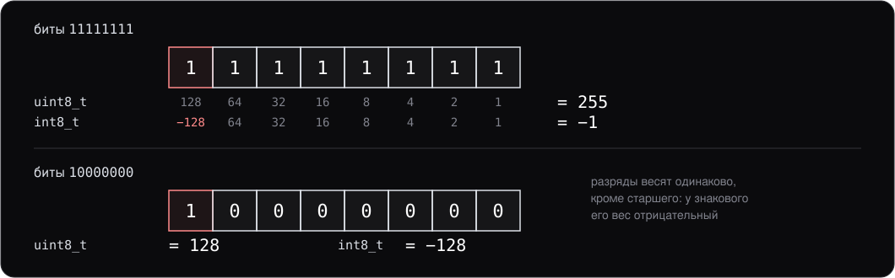

# Как устроены числа

> Дополнительный материал курса: конспект для самостоятельного чтения. Слайдов к нему нет — он не читается на паре, а объясняет правила, которые лекция 1 даёт готовыми: не смешивать знаковые и беззнаковые, не сравнивать дробные через `==`, помнить про переполнение. Здесь — как числа лежат в памяти и почему правила именно такие.

## 0. О чём этот материал

Лекция 1, раздел 4, перечисляет подвохи встроенных чисел: `-1 < 1u` ложно, `0.1 + 0.2 != 0.3`, знаковое переполнение — UB. Каждое правило выглядит отдельным капризом языка, пока не видно, как устроены сами числа. А устроены они просто: целое — это набор битов с весами, дробное — двоичная запись с плавающей точкой фиксированной длины. Всё остальное — следствия.

К концу чтения вы должны:

- читать биты знакового и беззнакового целого и объяснять дополнительный код;
- пользоваться побитовыми операциями и масками и не путать их с логическими;
- знать, во что превращается выражение со смешанными типами, и находить в нём ловушку до запуска;
- объяснять, почему 0.1 не хранится точно, и сравнивать дробные числа осмысленно;
- знать особые значения — бесконечности, NaN, отрицательный ноль — и почему NaN ломает `std::set` и `std::sort`;
- читать многобайтовое число из двоичных данных независимо от порядка байтов машины.

Переполнение и сдвиги как UB разобраны в материале [«Undefined behavior и его соседи»](../undefined-behavior/notes.md); здесь они встречаются только там, где вытекают из устройства чисел. Примеры собраны clang 19 под Windows, выводы — с настоящих прогонов.

## 1. Целые: дополнительный код

Беззнаковое целое из `n` битов — обычная двоичная запись: младший бит весит 1, следующий 2, старший — `2^(n−1)`. Знаковое устроено почти так же, с одним отличием: **вес старшего бита отрицательный**. Это и есть **[дополнительный код](../../glossary.md#twos-complement)** (two's complement); с C++20 стандарт требует именно его, до этого он был лишь повсеместной практикой.



Биты нескольких значений `int8_t` (через `std::bit_cast<std::uint8_t>`, чтобы увидеть их как есть):

```
    0 → 00000000
    1 → 00000001
  127 → 01111111
   -1 → 11111111
   -2 → 11111110
 -128 → 10000000
```

Отсюда три свойства, которые встречаются постоянно.

- **Смена знака — инверсия и плюс один.** `~x + 1 == -x`: для 5 получается −5. Поэтому процессору не нужна отдельная схема вычитания: `a - b` — это `a + ~b + 1`.
- **Сложение одно на оба типа.** Биты складываются одинаково, различается только прочтение результата. Одна и та же команда процессора складывает и `int`, и `unsigned`.
- **Диапазон несимметричен.** У `int8_t` от −128 до 127: нулю досталась одна из «положительных» комбинаций. Поэтому `-INT_MIN` не помещается в `int` — это переполнение, и для `int` оно [UB](../../glossary.md#ub) (undefined behavior; материал про UB, раздел 6).

## 2. Побитовые операции

Раз целое — это набор битов, с ними можно работать напрямую. **[Побитовые операции](../../glossary.md#bitwise)** (bitwise operations) считают каждый бит результата по соответствующим битам операндов; логические `&&`, `||`, `!` — это другие операции, про них ниже.

| Операция | Что делает | На четырёх битах |
|---|---|---|
| `a & b` | И: бит равен 1, если единица у обоих | `1100 & 1010 = 1000` |
| `a \| b` | ИЛИ: бит равен 1, если единица хотя бы у одного | `1100 \| 1010 = 1110` |
| `a ^ b` | исключающее ИЛИ: бит равен 1, если биты разные | `1100 ^ 1010 = 0110` |
| `~a` | инверсия всех битов | `~1100 = 0011` |
| `a << n` | **[сдвиг влево](../../glossary.md#shift)** (shift): биты уезжают к старшим | `0011 << 2 = 1100` |
| `a >> n` | сдвиг вправо: биты уезжают к младшим | `1100 >> 2 = 0011` |

Главное применение — **флаги в одном числе**. Каждому признаку отводится свой бит, и набор признаков события помещается в один `std::uint32_t`; число с единицами на интересующих битах называется **[маской](../../glossary.md#bitmask)** (bitmask).

```cpp
constexpr std::uint32_t kSigned      = 1u << 0;
constexpr std::uint32_t kFromNetwork = 1u << 1;
constexpr std::uint32_t kQuarantined = 1u << 2;

std::uint32_t flags = kSigned | kFromNetwork;      // поставить два бита
bool is_signed = (flags & kSigned) != 0;           // проверить бит
flags &= ~kQuarantined;                            // снять бит
flags ^= kFromNetwork;                             // переключить бит
```

```
flags = 0x00000001, is_signed = true
```

Второе применение — арифметика степенями двойки: `x << 3` это `x * 8`, а `x >> 3` для беззнакового — `x / 8`. Писать так ради скорости не нужно, компилятор делает эту замену сам; читаться умножение будет понятнее. Третье — сборка числа из байтов, ею занят раздел 9.

Четыре подвоха, каждый из которых встречается в чужом коде.

- **Приоритет ниже, чем у сравнений.** `if (flags & kSigned == 0)` компилируется и означает `flags & (kSigned == 0)` — не то, что задумано. Скобки вокруг побитовой операции обязательны.
- **Сдвиг на ширину типа и больше — UB.** Для `std::uint32_t` законны сдвиги на 0…31; `x << 32` — не ноль, а UB (материал про UB, раздел 6).
- **Инверсия узкого типа даёт `int`.** `~std::uint8_t{0}` — это −1 типа `int`, а не 255: операнд сначала повышается до `int` (раздел 3). Результат нужно приводить обратно явно.
- **Знаковые сдвиги.** Сдвиг вправо отрицательного числа сохраняет знак, а сдвиг влево до C++20 был UB; с C++20 оба определены через дополнительный код. В новом коде биты всё равно крутят на беззнаковых типах — там вопросов не возникает вовсе.

### Побитовые и логические — разные операции

`&&`, `||` и `!` смотрят не на биты, а на истинность выражения целиком, и у них есть **[сокращённое вычисление](../../glossary.md#short-circuit)** (short-circuit evaluation): правый операнд не вычисляется, если ответ ясен по левому (лекция 1, раздел 5). У `&`, `|`, `^` этого нет — оба операнда вычисляются всегда.

```cpp
if (p != nullptr && p->ready) { /* ... */ }   // безопасно
if (p != nullptr &  p->ready) { /* ... */ }   // разыменует nullptr всегда — UB
```

Путаница ходит в обе стороны: `if (flags && kSigned)` вместо `flags & kSigned` спрашивает «оба числа ненулевые» и для непустой маски истинно всегда.

**Правило:** условие — логическая операция, биты — побитовая. Если операнды не `bool`, а числа, почти наверняка нужна побитовая.

## 3. Integral promotion: арифметика начинается с `int`

Лекция 1 описывает смешение типов как «меньший тип приводится к большему». Точное правило жёстче, и его стоит знать, потому что на нём держится половина числовых ловушек.

**Шаг первый — [integral promotion](../../glossary.md#integral-promotion)** (по-русски — целочисленное продвижение; в стандарте C тот же механизм называется integer promotions). Всё, что меньше `int` — `char`, `short`, `bool`, `std::uint8_t`, `std::uint16_t`, — **до** любой арифметики превращается в `int`. Сложение двух `std::uint8_t` — это сложение двух `int`:

```cpp
std::uint8_t a = 200;
std::uint8_t b = 100;
auto sum = a + b;
static_assert(std::is_same_v<decltype(sum), int>);
std::uint8_t stored = a + b;
```

```
200 + 100 в uint8_t: выражение 300 типа int, сохранено 44
```

Выражение честно дало 300; обрезалось оно при записи обратно в `std::uint8_t`: 300 − 256 = 44.

**Шаг второй — [обычные арифметические преобразования](../../glossary.md#usual-arithmetic-conversions)** (usual arithmetic conversions). Если после повышения типы всё ещё разные, они приводятся к общему. И правило для знакового и беззнакового одинакового размера такое: **общим становится беззнаковый**.

```cpp
int negative = -1;
unsigned positive = 1;
std::print("-1 < 1u: {}\n", negative < positive);
std::print("std::cmp_less(-1, 1u): {}\n", std::cmp_less(negative, positive));
```

```
warning: comparison of integers of different signs: 'int' and 'unsigned int' [-Wsign-compare]
-1 < 1u: false
std::cmp_less(-1, 1u): true
```

`-1` превратилось в беззнаковое с теми же битами — 4 294 967 295 — и оказалось больше единицы. Компилятор предупреждает, если включены предупреждения. Когда сравнить знаковое с беззнаковым действительно нужно, в C++20 для этого есть функции `std::cmp_less`, `std::cmp_greater`, `std::cmp_equal` из `<utility>`: они сравнивают математические значения.

**Ловушка, которая следует из первого шага.** Два `std::uint16_t` перемножаются как два `int`:

```cpp
std::uint32_t square(std::uint16_t x) {
    return x * x;  // оба множителя повышаются до int
}
```

Для `x = 65535` произведение 4 294 836 225 в `int` не помещается. Беззнаковые типы на входе и на выходе, а посередине — знаковое переполнение, то есть UB. Обычная сборка печатает «правильный» ответ, [UBSan](../../glossary.md#ubsan) (UndefinedBehaviorSanitizer) видит правду:

```
num/mul16.cpp:5:14: runtime error: signed integer overflow: 65535 * 65535 cannot be represented in type 'int'
4294836225
```

Лечится расширением до нужного типа **до** умножения: `std::uint32_t{x} * x`.

**Правило:** перед арифметикой с узкими типами решите, в каком типе должен считаться результат, и приведите к нему операнды явно. Узкий тип хорош для хранения, а не для вычислений.

## 4. Деление и остаток

Целочисленное деление в C++ отбрасывает дробную часть, **округляя к нулю**, а знак остатка совпадает со знаком делимого:

```
-7 / 2 = -3, -7 % 2 = -1
```

Равенство `(a / b) * b + a % b == a` выполняется всегда. Но `%` — не математический остаток по модулю: для отрицательного числа он отрицательный. Если нужен остаток в диапазоне `[0, n)` — например, индекс в кольцевом буфере при движении назад, — пишут `((a % n) + n) % n`. Деление на ноль и `INT_MIN / -1` — UB (материал про UB, раздел 8).

## 5. Преобразования и сужение

Преобразование дробного в целое **отбрасывает дробную часть**, тоже округляя к нулю: `static_cast<int>(-2.7)` даёт −2. Если значение не помещается в целевой тип, это UB:

```
num/cast.cpp:7:37: runtime error: 3e+09 is outside the range of representable values of type 'int'
static_cast<int>(3e9) = -2147483648
```

На x86 получилось `INT_MIN` — так ведёт себя команда процессора, — но это не обещание: другой компилятор вправе сделать иначе.

Преобразование, при котором значение может потеряться, называется **[сужающим](../../glossary.md#narrowing)** (narrowing). Обычная инициализация пропускает его молча, [инициализация списком](../../glossary.md#list-initialization) (list-initialization, фигурными скобками) — нет:

```cpp
double ratio = 3.5;
int a = ratio;   // молча отбрасывает дробную часть
int b{ratio};    // ошибка компиляции
```

```
error: type 'double' cannot be narrowed to 'int' in initializer list [-Wc++11-narrowing]
note: insert an explicit cast to silence this issue
```

Это ещё один довод за инициализацию списком: потерю значения приходится писать явно, через `static_cast` (лекция 3, раздел 4), и в коде видно, где она происходит.

## 6. Дробные: IEEE 754

`double` — это не десятичная дробь, а двоичная запись **[с плавающей точкой](../../glossary.md#floating-point)** (floating point), устроенная по стандарту IEEE 754. 64 бита делятся на три поля: **знак**, **порядок** (exponent, степень двойки) и **мантиссу** (значащие цифры). Значение — `±1,мантисса × 2^порядок`: единица перед запятой подразумевается и не хранится.


В двоичной записи точно представимы только дроби со знаменателем-степенью двойки: 0,5, 0,25, 0,375. У 0,1 знаменатель 10, и её двоичная запись бесконечна — как 1/3 в десятичной. В 52 бита помещается начало, остальное округляется. То, что хранится на самом деле:

```
0.1 точно: 0.1000000000000000055511151
биты 0.1: 0x3fb999999999999a
```

Отсюда всё знаменитое:

```
0.1 + 0.2 = 0.30000000000000004
0.1 + 0.2 == 0.3: false
десять раз по 0.1 = 0.9999999999999999
```

Каждое из чисел хранится с ошибкой в последнем бите, и ошибки складываются. `std::print` печатает самую короткую запись, которая при обратном чтении даёт то же число, — поэтому `0.30000000000000004` и видно, а `0.3` — нет.

**Точность конечна и зависит от величины.** У `float` мантисса 23 бита плюс подразумеваемая единица — 24 бита, это около семи десятичных цифр. После 2^24 = 16 777 216 соседние `float` отстоят друг от друга на 2, и прибавление единицы теряется целиком:

```
float: 16777216 + 1 = 16777216
float 0.1 = 0.1000000015
```

У `double` 53 бита — около шестнадцати цифр. `std::numeric_limits<double>::epsilon()` — расстояние от 1 до следующего `double`:

```
epsilon double = 2.220446049250313e-16
```

Это шаг около единицы. Около тысячи соседние `double` отстоят уже примерно на `1e-13`, около миллиона — на `1e-10`: расстояние между соседними числами растёт вместе с числами.

**Как сравнивать.** Лекция 1 советует сравнение с допуском: `std::abs(a - b) < epsilon`. Постоянный допуск работает, пока числа одного масштаба: для величин около миллиона допуск `1e-9` строже, чем точность самих чисел, и сравнение всегда ложно; для величин около `1e-12` он больше самих чисел, и всё равно всему. Допуск надо брать относительный — долю от большего из двух — и нижнюю границу на случай сравнения с нулём:

```cpp
bool nearly_equal(double a, double b, double rel = 1e-9, double abs_floor = 1e-12) {
    const double diff = std::abs(a - b);
    return diff <= abs_floor || diff <= rel * std::max(std::abs(a), std::abs(b));
}
```

Какие именно числа подставить, решает задача, а не язык: это вопрос о том, с какой точностью измерены сами данные.

**Правило:** если величина по смыслу целая — время, деньги, счётчик, — храните её целым. Метка времени в `os_event` — `uint64_t` миллисекунд, а не `double` секунд, и две метки из одного источника можно сравнивать через `==`.

## 7. Особые значения

IEEE 754 резервирует несколько комбинаций битов под значения, которые не являются обычными числами.

```
0.0 / 0.0 = -nan
nan == nan: false, nan < 1: false, 1 < nan: false, nan != nan: true
std::isnan: true
(nan <=> 1.0) == unordered: true
1.0 / 0.0 = inf, -1.0 / 0.0 = -inf
-0.0 == 0.0: true, 1 / -0.0 = -inf
```

- **Бесконечности** `inf` и `-inf` — результат деления ненулевого на ноль и переполнения. С ними можно считать: `inf + 1 == inf`.
- **NaN** (not a number) — результат операций без смысла: `0.0 / 0.0`, `inf - inf`, корень из отрицательного. Минус в `-nan` — просто знаковый бит: процессор x86 выдаёт NaN с установленным знаком, а `std::print` его показывает. Главное свойство NaN — **любое сравнение с ним ложно**, включая `nan == nan`, и только `!=` истинно. Проверять — `std::isnan(x)`, и никогда `x == NAN`. Поэтому же `<=>` для `double` возвращает `std::partial_ordering`, а не `strong_ordering`: для NaN ответ — `unordered` (лекция 5, раздел 5).
- **Отрицательный ноль** `-0.0` равен `0.0`, но помнит знак: `1 / -0.0` — минус бесконечность.

Деление на ноль для дробных — не UB, а определённый стандартом IEEE 754 результат. Для целых — UB.

## 8. NaN ломает контейнеры и алгоритмы

`std::set`, `std::map`, `std::sort` и все упорядоченные контейнеры и алгоритмы требуют от сравнения **[строгого слабого порядка](../../glossary.md#strict-weak-ordering)** (strict weak ordering). Среди прочего это значит: если `a` не меньше `b` и `b` не меньше `a`, то `a` и `b` эквивалентны, и эквивалентность транзитивна — эквивалентные одному и тому же эквивалентны между собой.

NaN это ломает. Он не меньше единицы и единица не меньше его — значит, «эквивалентен» единице. Так же «эквивалентен» тройке. Но единица и тройка не эквивалентны. Контейнер, построенный на таком сравнении, получает противоречивые ответы и ведёт себя непредсказуемо:

```cpp
std::set<double> s{1.0, 3.0};
s.insert(nan);
s.insert(2.0);
// s.count(nan) ?

std::vector<double> v{5, 3, nan, 4, 1, 2, nan, 0};
std::sort(v.begin(), v.end());
```

```
set: 1 2 3
count(2.0) = 1, count(nan) = 1
sort: 0 1 3 5 nan 2 4 nan
```

NaN во множество не попал — вставка решила, что эквивалентный элемент уже есть, — но `count(nan)` отвечает, что NaN там есть. Сортировка оставила массив неотсортированным. И это ещё мягкий исход: сортировка со сравнением, которое нарушает строгий слабый порядок, — UB, и реализация вправе, например, выйти за границы массива.

То же с `std::map<double, …>`: NaN в ключе, приехавший из данных, тихо портит словарь.

**Правило:** проверяйте дробные числа на границе, где они входят в программу. Разбор числа из текста — например, поля телеметрии через `std::from_chars` — честно превратит строки `nan` и `inf` в соответствующие значения, и дальше они разойдутся по контейнерам. `std::isfinite(x)` отсекает сразу и NaN, и бесконечности.

## 9. Порядок байтов

Многобайтовое число лежит в памяти несколькими байтами, и их порядок — **[порядок байтов](../../glossary.md#endianness)** (byte order, endianness) — не задан ни стандартом C++, ни здравым смыслом: его выбирает процессор.


```
0x0A0B0C0D в памяти: 0d 0c 0b 0a
little endian: true
```

x86 и, как правило, ARM — **little endian**: младший байт по младшему адресу. Сетевые протоколы и многие двоичные форматы — **big endian**: старший байт первым, как числа пишут люди. Пока данные не покидают программу, порядок байтов не виден. Он становится виден, когда байты приходят снаружи: пакет, файл, двоичная телеметрия.

Пусть в заголовке двоичной записи длина — четыре байта, старший первым: `00 00 01 2c`, то есть 300.

```cpp
std::uint32_t read_be32(const std::byte* p) {
    return (std::to_integer<std::uint32_t>(p[0]) << 24) |
           (std::to_integer<std::uint32_t>(p[1]) << 16) |
           (std::to_integer<std::uint32_t>(p[2]) << 8) |
           std::to_integer<std::uint32_t>(p[3]);
}
```

```
memcpy как есть: 738263040
read_be32:       300
std::byteswap:   300
```

Скопированные как есть, байты прочитались в порядке машины — получилось 738 263 040. Длина записи в семьсот мегабайт, прочитанная из чужих данных, — это либо отказ в выделении памяти, либо, если по ней резать буфер, обращение за его пределы.

Два правильных способа. Первый — собирать число сдвигами, как `read_be32`: он описывает формат данных, а не машину, и работает на любом процессоре. Второй — скопировать байты и развернуть их функцией `std::byteswap` (C++23), если порядок машины — `std::endian::native` (C++20) — отличается от порядка данных. Чего делать нельзя — `*reinterpret_cast<const std::uint32_t*>(p)`: адрес внутри буфера может быть не [выровнен](../../glossary.md#alignment) (aligned), а чтение через указатель чужого типа нарушает [strict aliasing](../../glossary.md#strict-aliasing) — UB в обоих случаях (лекция 3, раздел 4; лекция 6, раздел 3).

## Итоги

- Знаковые целые — дополнительный код: старший бит весит отрицательно. Сложение одно на оба типа, смена знака — `~x + 1`, диапазон несимметричен.
- Побитовые операции работают с каждым битом, логические — с истинностью выражения и не всегда вычисляют правый операнд. Флаги держат маской в одном целом; сдвиг на ширину типа и больше — UB; `&` и `|` по приоритету ниже сравнений, поэтому скобки.
- Всё, что меньше `int`, до арифметики повышается до `int`; при смешении знакового и беззнакового одного размера побеждает беззнаковый. Отсюда `-1 < 1u == false` и знаковое переполнение в `uint16_t * uint16_t`. Для сравнения разных знаков — `std::cmp_less`.
- Деление и преобразование дробного в целое округляют к нулю; `%` отрицателен для отрицательного делимого; значение вне диапазона при преобразовании — UB. Фигурные скобки запрещают молчаливое сужение.
- `double` — знак, 11 бит порядка и 52 бита мантиссы. 0,1 не представима точно, ошибки накапливаются, шаг между соседними числами растёт с величиной. Сравнивают с относительным допуском, а целые по смыслу величины хранят целыми.
- Бесконечности, NaN и `-0.0` — законные значения. Любое сравнение с NaN ложно; проверка — `std::isnan`, `std::isfinite`.
- NaN нарушает строгий слабый порядок и ломает `std::set`, `std::map`, `std::sort`. Фильтровать — на границе ввода.
- Порядок байтов задаёт процессор. Двоичные данные читают сдвигами или `std::byteswap` по `std::endian::native`, а не приведением указателя.

## Что дальше

Материал опирается на **лекцию 1**, раздел 4, и материал [«Undefined behavior и его соседи»](../undefined-behavior/notes.md) и подпирает:

- **лекцию 3**, раздел 4 — `static_cast` и `reinterpret_cast`: где преобразование числа меняет значение и почему приведение указателя на байты — плохой способ читать данные;
- **лекцию 5**, раздел 5 — `partial_ordering` у `double`;
- **лекцию 6**, раздел 3 — выравнивание, из-за которого нельзя читать `uint32_t` по произвольному адресу буфера;
- **лекцию 13**, раздел 6 — упорядоченные контейнеры и требование к сравнению, которое NaN нарушает.
